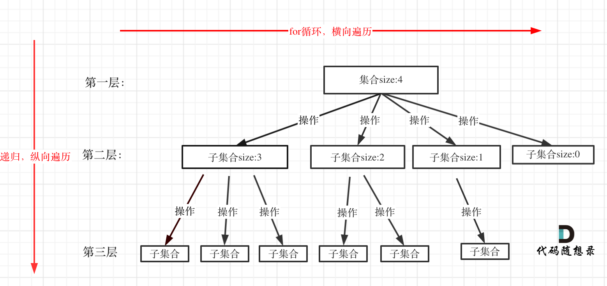

# C++coding机试技巧


## 代码规范

### 变量命名

* **小驼峰命名法**：第一个单词首字母小写，其他单词首字母大写；例如 `int myAge;`
* 大驼峰命名法：单词的首字母都大写；例如：``int MyAge;``
* 下划线命名法：名称中的每一个逻辑断点都用一个下划线来标记；例如：`int my_age;`
* 匈牙利命名法：变量名 = 属性 + 类型 + 对象描述；例如：`int iMyAge;`

### 代码空格

- [x] 操作符`=`左右空格

```
i = i+1;
```

- [x] 分隔符（`,` 、`;`）后空格


```
int i, j;
for(int fastIndex=0; fastIndex<nums.size(); fastIndex++)
```

- [x] 大括号和函数保持同一行，与控制语句（while，if，for）前空格


```
while(n) {
    n--;
}
```


## 时间复杂度

### 超时

- 问题规模过大，考虑时间或者空间**复杂度更低的算法**
- 机器、语言、编译器的强度
- **循环嵌套**，如递归**栈溢出**，采用其他算法

### 大O

> 空间复杂度S(n)：一般不包括程序本身，仅考虑程序运行时占用**内存的大小**

- **一般情况下**算法复杂度是关于问题规模n的运行单元数/内存空间f(n)的渐进

- 大O中对f(n)的计算会**忽略低阶项和常数项**；但实际情况下，由于问题规模和忽略项的大小会存在很大的差异
- O(1)常数阶 < O(logn)对数阶 < O(n)线性阶 < O(n^2)平方阶 < O(n^3)立方阶 < O(2^n)指数阶

### 递归

- 递归算法复杂度=递归的次数 * 每次递归中的操作次数/内存要求；一般可以通过树形结构计算
- 注意传参形式，传值调用、指针调用、引用调用


## 常用头

### 头文件

#### 标准c库

| 头文件       | 说明         | 头文件           | 说明             | 头文件          | 说明         |
| ------------ | ------------ | ---------------- | ---------------- | --------------- | ------------ |
| assert.h     | 断言相关     | ctype.h          | 字符类型判断     | errno.h         | 标准错误机制 |
| float.h      | 浮点限制     | limits.h         | 整形限制         | locale.h        | 本地化接口   |
| math.h/cmath | 数学函数     | setjmp.h         | 非本地跳转       | signal.h        | 信号相关     |
| stdarg.h     | 可变参数处理 | stddef.h         | 宏和类型定义     | stdio.h/cstdlib | 标准I/O      |
| stdlib.h     | 标准工具库   | string.h/cstring | 字符串和内存处理 | time.h          | 时间相关     |
| cstdio       | c标准IO      |                  |                  |                 |              |

#### STL库

> using namespace std;

| 头文件    | 说明      | 头文件 | 说明          | 头文件  | 说明         |
| --------- | --------- | ------ | ------------- | ------- | ------------ |
| algorithm | 通用算法  | deque  | 双端队列      | vector  | 向量         |
| iterator  | 迭代器    | stack  | 栈            | map     | 图（键值对） |
| list      | 列表      | string | 字符串        | set     | 集合         |
| queue     | 队列      | bitset | bit类         | numeric | 数值算法     |
| iostream  | C++标准IO | bitset | C++标准位序列 |         |              |

### 宏定义

```C++
//求最大值和最小值
#define  MAX(x,y) (((x)>(y)) ? (x) : (y))
#define  MIN(x,y) (((x) < (y)) ? (x) : (y))
```

```C++
//取余
#define  mod(x) ((x)%MOD)
```

```C++
//for循环
#define  FOR(i,f_start,f_end) for(int i=f_start;i<=f_end;++i) 
```

```C++
//返回数组元素的个数
#define  ARR_SIZE(a)  (sizeof((a))/sizeof((a[0])))
```

```C++
//初始化数组
#define MT(x,i) memset(x,i,sizeof(x))
#define MEM(a,b) memset((a),(b),sizeof(a))
```

```C++
//符号重定义
#define LL long long
#define ull unsigned long long
#define pii pair<int,int>
```

```C++
//常见常数
#define PI acos(-1.0)
#define eps 1e-12
#define INF 0x3f3f3f3f //int最大值
const int INF_INT = 2147483647;
const ll INF_LL = 9223372036854775807LL;
const ull INF_ULL = 18446744073709551615Ull;
const ll P = 92540646808111039LL;
const ll maxn = 1e5 + 10, MOD = 1e9 + 7;
const int Move[4][2] = {-1,0,1,0,0,1,0,-1};
const int Move_[8][2] = {-1,-1,-1,0,-1,1,0,-1,0,1,1,-1,1,0,1,1};
```

### 函数

#### atoi()

```C++
#include <stdlib.h>
#include <cstring>
int atoi(const char *str)
//把参数 str 所指向的字符串转换为一个整数（类型为 int 型）,如果没有执行有效的转换，则返回零

int num = atoi(<string>.c_str());
```


## new堆区使用

### 常规

```c++
int *x = new int;       		//开辟一个存放整数的存储空间，返回一个指向该空间的地址(即指针)
int *a = new int(100);  		//开辟一个存放整数的空间，指定初值为100，返回一个指向该空间的地址
char *b = new char[10]; 		//开辟一个存放字符的10字符大小的数组空间，返回首元素的地址
```

### 动态申请列大小固定的二维数组

```c++
const int MAXCOL = 3;			//固定列值
cin>>row;
//申请一维数据并将其转成二维数组指针
int *pp_arr = new int[nRow * MAXCOL];
int (*p)[MAXCOL] = (int(*)[MAXCOL])pp_arr;
//此时p[i][j]就可正常使用
```


### 动态申请大小不固定的二维数组

```c++
cin>>row>>col;
int **p = new int*[row];
for (int i = 0; i < row; i ++)
{
    p[i] = new int[col];
}
```


## 常用STL

> 参考：

[https://blog.csdn.net/f_zyj/article/details/51594851](https://blog.csdn.net/f_zyj/article/details/51594851)  
[https://download.csdn.net/download/f_zyj/9988653](https://download.csdn.net/download/f_zyj/9988653)

### 简述
####  STL底层说明

C++ STL 的实现：

```
1.vector      底层数据结构为数组 ，支持快速随机访问

2.list            底层数据结构为双向链表，支持快速增删

3.deque       底层数据结构为一个中央控制器和多个缓冲区，详细见STL源码剖析P146，支持首尾（中间不能）快速增删，也支持随机访问
deque是一个双端队列(double-ended queue)，也是在堆中保存内容的.它的保存形式如下:
[堆1] --> [堆2] -->[堆3] --> ...
每个堆保存好几个元素,然后堆和堆之间有指针指向,看起来像是list和vector的结合品.

4.stack        底层一般用list或deque实现，封闭头部即可，不用vector的原因应该是容量大小有限制，扩容耗时

5.queue     底层一般用list或deque实现，封闭头部即可，不用vector的原因应该是容量大小有限制，扩容耗时

（stack和queue其实是适配器,而不叫容器，因为是对容器的再封装）

6.priority_queue     的底层数据结构一般为vector为底层容器，堆heap为处理规则来管理底层容器实现

7.set                   底层数据结构为红黑树，有序，不重复

8.multiset         底层数据结构为红黑树，有序，可重复 

9.map                底层数据结构为红黑树，有序，不重复

10.multimap    底层数据结构为红黑树，有序，可重复

11.hash_set     底层数据结构为hash表，无序，不重复

12.hash_multiset 底层数据结构为hash表，无序，可重复 

13.hash_map    底层数据结构为hash表，无序，不重复

14.hash_multimap 底层数据结构为hash表，无序，可重复 
```

#### CCF 编译出错原因： 不允许C++STL容器嵌套（需要满足相应的格式）

就是要在后面的“>”之间，必须得有一个空格，如果有多层，那每层都得有一个空格。
```c++
map<string,list<string> > user;
```

### algorithm

**头文件：lgorithm**

函数参数，返回值以及具体的使用方法请自行去头文件找定义！！！

#### 不修改内容的序列操作

|函数|说明|
| -------------------------------------------------------- | ------------------------------------------------------------ |
| adjacent_find| 查找两个相邻（Adjacent）的等价（Identical）元素              |
| all_ofC++11                                              | 检测在给定范围中是否所有元素都满足给定的条件                 |
| any_ofC++11                                              | 检测在给定范围中是否存在元素满足给定条件                     |
| count         | 返回值等价于给定值的元素的个数                               |
| count_if      | 返回值满足给定条件的元素的个数                               |
| equal         | 返回两个范围是否相等                                         |
| find           | 返回第一个值等价于给定值的元素                               |
| find_end                                                 | 查找范围*A*中与范围*B*等价的子范围最后出现的位置             |
| find_first_of | 查找范围*A*中第一个与范围*B*中任一元素等价的元素的位置       |
| find_if                                                  | 返回第一个值满足给定条件的元素                               |
| find_if_notC++11                                         | 返回第一个值不满足给定条件的元素                             |
| for_each                                                 | 对范围中的每个元素调用指定函数                               |
| mismatch                                                 | 返回两个范围中第一个元素不等价的位置                         |
| none_ofC++11                                             | 检测在给定范围中是否不存在元素满足给定的条件                 |
| search          | 在范围*A*中查找第一个与范围*B*等价的子范围的位置             |
| search_n                                                 | 在给定范围中查找第一个连续*n*个元素都等价于给定值的子范围的位置 |

#### 修改内容的序列操作

|函数|说明|
| -------------------------------------------------------- | ------------------------------------------------------------ |
| copy         | 将一个范围中的元素拷贝到新的位置处                           |
| copy_backward                                          | 将一个范围中的元素按逆序拷贝到新的位置处                     |
| copy_ifC++11                                           | 将一个范围中满足给定条件的元素拷贝到新的位置处               |
| copy_nC++11                                            | 拷贝 n 个元素到新的位置处                                    |
| fill         | 将一个范围的元素赋值为给定值                                 |
| fill_n                                                 | 将某个位置开始的 n 个元素赋值为给定值                        |
| generate                                               | 将一个函数的执行结果保存到指定范围的元素中，用于批量赋值范围中的元素 |
| generate_n                                             | 将一个函数的执行结果保存到指定位置开始的 n 个元素中          |
| iter_swap                                              | 交换两个迭代器（Iterator）指向的元素                         |
| moveC++11     | 将一个范围中的元素移动到新的位置处                           |
| move_backwardC++11                                     | 将一个范围中的元素按逆序移动到新的位置处                     |
| random_shuffle                                         | 随机打乱指定范围中的元素的位置                               |
| remove       | 将一个范围中值等价于给定值的元素删除                         |
| remove_if                                              | 将一个范围中值满足给定条件的元素删除                         |
| remove_copy                                            | 拷贝一个范围的元素，将其中值等价于给定值的元素删除           |
| remove_copy_if                                         | 拷贝一个范围的元素，将其中值满足给定条件的元素删除           |
| replace      | 将一个范围中值等价于给定值的元素赋值为新的值                 |
| replace_copy                                           | 拷贝一个范围的元素，将其中值等价于给定值的元素赋值为新的值   |
| replace_copy_if                                        | 拷贝一个范围的元素，将其中值满足给定条件的元素赋值为新的值   |
| replace_if                                             | 将一个范围中值满足给定条件的元素赋值为新的值                 |
| reverse      | 反转排序指定范围中的元素                                     |
| reverse_copy                                           | 拷贝指定范围的反转排序结果                                   |
| rotate      | 循环移动指定范围中的元素                                     |
| rotate_copy                                            | 拷贝指定范围的循环移动结果                                   |
| shuffleC++11 | 用指定的随机数引擎随机打乱指定范围中的元素的位置             |
| swap        | 交换两个对象的值                                             |
| swap_ranges | 交换两个范围的元素                                           |
| transform   | 对指定范围中的每个元素调用某个函数以改变元素的值             |
| unique                                                 | 删除指定范围中的所有连续重复元素，仅仅留下每组等值元素中的第一个元素。 |
| unique_copy                                            | 拷贝指定范围的唯一化（参考上述的 unique）结果                |

#### 划分操作
|函数|说明|
| -------------------------------------------------------- | ------------------------------------------------------------ |
|is_partitionedC++11| 检测某个范围是否按指定谓词（Predicate）划分过|
|partition  | 将某个范围划分为两组|
|partition_copyC++11 | 拷贝指定范围的划分结果|
|partition_pointC++11  |  返回被划分范围的划分点|
|stable_partition   | 稳定划分，两组元素各维持相对顺序|

#### 排序操作

|函数|说明|
| -------------------------------------------------------- | ------------------------------------------------------------ |
|is_sortedC++11 | 检测指定范围是否已排序|
|is_sorted_untilC++11    |返回最大已排序子范围|
|nth_element 部份排序指定范围中的元素，使得范围按给定位置处的元素划分|
|partial_sort   | 部份排序|
|partial_sort_copy  | 拷贝部分排序的结果|
|sort  |  排序|
|stable_sort |稳定排序|

#### 二分法查找操作


|函数|说明|
| -------------------------------------------------------- | ------------------------------------------------------------ |
|binary_search |  判断范围中是否存在值等价于给定值的元素|
|equal_range |返回范围中值等于给定值的元素组成的子范围|
|lower_bound |返回指向范围中第一个值大于或等于给定值的元素的迭代器|
|upper_bound |返回指向范围中第一个值大于给定值的元素的迭代器|


#### 集合操作


|函数|说明|
| -------------------------------------------------------- | ------------------------------------------------------------ |
|includes  |  判断一个集合是否是另一个集合的子集|
|inplace_merge  | 就绪合并|
|merge   合并|
|set_difference | 获得两个集合的差集|
|set_intersection |   获得两个集合的交集|
|set_symmetric_difference  |  获得两个集合的对称差|
|set_union  | 获得两个集合的并集|


#### 堆操作

|函数|说明|
| -------------------------------------------------------- | ------------------------------------------------------------ |
|is_heap |检测给定范围是否满足堆结构|
|is_heap_untilC++11  |检测给定范围中满足堆结构的最大子范围|
|make_heap |  用给定范围构造出一个堆|
|pop_heap   | 从一个堆中删除最大的元素|
|push_heap |  向堆中增加一个元素|
|sort_heap  | 将满足堆结构的范围排序|

#### 最大/最小操作

|函数|说明|
| -------------------------------------------------------- | ------------------------------------------------------------ |
|is_permutationC++11 |判断一个序列是否是另一个序列的一种排序|
|lexicographical_compare |比较两个序列的字典序|
|max |返回两个元素中值最大的元素|
|max_element |返回给定范围中值最大的元素|
|min |返回两个元素中值最小的元素|
|min_element |返回给定范围中值最小的元素|
|minmaxC++11 |返回两个元素中值最大及最小的元素|
|minmax_elementC++11|返回给定范围中值最大及最小的元素|
|next_permutation  |  返回给定范围中的元素组成的下一个按字典序的排列|
|prev_permutation  |  返回给定范围中的元素组成的上一个按字典序的排列|

### vector

**头文件：vector**

在STL的vector头文件中定义了vector（向量容器模版类），vector容器以连续数组的方式存储元素序列，可以将vector看作是以顺序结构实现的线性表。当我们在程序中需要使用动态数组时，vector将会是理想的选择，vector可以在使用过程中动态地增长存储空间。 
vector模版类需要两个模版参数，第一个参数是存储元素的数据类型，第二个参数是存储分配器的类型，其中第二个参数是可选的，如果不给出第二个参数，将使用默认的分配器

下面给出几个常用的定义vector向量对象的方法示例：
```c++

vector<int> s;      
//  定义一个空的vector对象，存储的是int类型的元素
vector<int> s(n);   
//  定义一个含有n个int元素的vector对象
vector<int> s(first, last); 
//  定义一个vector对象，并从由迭代器first和last定义的序列[first, last)中复制初值

```

vector的基本操作：
```c++

s[i]                //  直接以下标方式访问容器中的元素
s.front()           //  返回首元素
s.back()            //  返回尾元素
s.push_back(x)      //  向表尾插入元素x
s.size()            //  返回表长
s.empty()           //  表为空时，返回真，否则返回假
s.pop_back()        //  删除表尾元素
s.begin()           //  返回指向首元素的随机存取迭代器
s.end()             //  返回指向尾元素的下一个位置的随机存取迭代器
s.insert(it, val)   //  向迭代器it指向的元素前插入新元素val
s.insert(it, n, val)//  向迭代器it指向的元素前插入n个新元素val
s.insert(it, first, last)   
//  将由迭代器first和last所指定的序列[first, last)插入到迭代器it指向的元素前面
s.erase(it)         //  删除由迭代器it所指向的元素
s.erase(first, last)//  删除由迭代器first和last所指定的序列[first, last)
s.reserve(n)        //  预分配缓冲空间，使存储空间至少可容纳n个元素
s.resize(n)         //  改变序列长度，超出的元素将会全部被删除，如果序列需要扩展（原空间小于n），元素默认值将填满扩展出的空间
s.resize(n, val)    //  改变序列长度，超出的元素将会全部被删除，如果序列需要扩展（原空间小于n），val将填满扩展出的空间
s.clear()           //  删除容器中的所有元素
s.swap(v)           //  将s与另一个vector对象进行交换
s.assign(first, last)
//  将序列替换成由迭代器first和last所指定的序列[first, last)，[first, last)不能是原序列中的一部分

//  要注意的是，resize操作和clear操作都是对表的有效元素进行的操作，但并不一定会改变缓冲空间的大小
//  另外，vector还有其他的一些操作，如反转、取反等，不再一一列举
//  vector上还定义了序列之间的比较操作运算符（>、<、>=、<=、==、!=），可以按照字典序比较两个序列。
//  还是来看一些示例代码吧……

/*
 * 输入个数不定的一组整数，再将这组整数按倒序输出
 */

#include <iostream>
#include <vector>

using namespace std;

int main()
{
    vector<int> L;
    int x;
    while(cin >> x)
    {
        L.push_back(x);
    }
    for (int i = L.size() - 1; i >= 0; i--)
    {
        cout << L[i] << " ";
    }
    cout << endl;
    return 0;
}
```

### list

**头文件：list**


下面给出几个常用的定义list对象的方法示例：
```c++

list<int>a{1,2,3}
list<int>a(n)    //声明一个n个元素的列表，每个元素都是0
list<int>a(n, m)  //声明一个n个元素的列表，每个元素都是m
list<int>a(first, last)  //声明一个列表，其元素的初始值来源于由区间所指定的序列中的元素，first和last是迭代器

```

list的基本操作：

```c++

a.begin()           //  返回指向首元素的随机存取迭代器
a.end()             //  返回指向尾元素的下一个位置的随机存取迭代器
a.push_front(x)     //  向表头插入元素x
a.push_back(x)      //  向表尾插入元素x
a.pop_back()        //  删除表尾元素
a.pop_front()       //  删除表头元素
a.size()            //  返回表长
a.empty()           //  表为空时，返回真，否则返回假
a.resize(n)         //  改变序列长度，超出的元素将会全部被删除，如果序列需要扩展（原空间小于n），元素默认值将填满扩展出的空间
a.resize(n, val)    //  改变序列长度，超出的元素将会全部被删除，如果序列需要扩展（原空间小于n），val将填满扩展出的空间
a.clear()           //  删除容器中的所有元素
a.front()           //  返回首元素
a.back()            //  返回尾元素
a.swap(v)           //  将a与另一个list对象进行交换
a.merge(b)          //  调用结束后b变为空，a中元素包含原来a和b的元素
a.insert(it, val)   //  向迭代器it指向的元素前插入新元素val
a.insert(it, n, val)//  向迭代器it指向的元素前插入n个新元素val
a.insert(it, first, last)   
//  将由迭代器first和last所指定的序列[first, last)插入到迭代器it指向的元素前面
a.erase(it)         //  删除由迭代器it所指向的元素
a.erase(first, last)//  删除由迭代器first和last所指定的序列[first, last)
a.remove(x)         //  删除了a中所有值为x的元素
a.assign(n, val)    // 将a中的所有元素替换成n个val元素
a.assign(b.begin(), b.end())
//将a变成b

```

### string

**头文件：string**

string是STL的字符串类型，通常用来表示字符串。而在使用string之前，字符串通常是用`char*`表示的。   
string和`char*`的区别  
string是一个类, `char*`是一个指向字符的指针。   
string封装了`char*`，管理这个字符串，是一个`char*`型的容器。也就是说string是一个容器，里面元素的数据类型是`char*`。  
string不用考虑内存释放和越界。   
string管理`char*`所分配的内存。每一次string的复制，取值都由string类负责维护，不用担心复制越界和取值越界等。  string提供了一系列的字符串操作函数   
查找find，拷贝copy，删除erase，替换replace，插入insert. 

构造和析构函数:

|表达式 |效果|
|---|---|
|string s   | 生成一个空字符串|
|string s(str)   |copy构造函数，生成一个str的复制品|
|string s(str,idx)  | 将string内始于位置idx的部分当作字符串s的初值|
|string s(str,idx,len)   |将string内始于位置idx且长度最多为len的部分当作字符串s的初值|
|string s(cstr) | 以C-string字符串cstr作为字符串s的初值|
|string s(cstr，len) | 以C-string字符串cstr的前len个字符作为字符串s的初值|
|string s(num，c) |生成一个字符串，包含num个字符c|
|string s(beg，end)   |以区间[beg,end]内所有字符作为字符串s的初值|

操作函数:

|操作函数   |效果|
|---|---|
|=，assign() |赋以新值|
|swap() |交换两个字符串的内容|
|+=, append(),push_back()   |添加字符|
|insert()|  插入字符|
|erase()    |删除字符|
|clear()    |移除全部字符|
|resize()   |改变字符数量|
|replace()|替换字符|
|+  |串联字符串|
|==，!=，<，<=，>，>=，compare()  |比较字符串内容|
|size(),length()|   返回字符数量,等效函数|
|max_size() |返回字符的最大可能个数|
|empty()    |判断字符串是否为空|
|capacity() |返回重新分配之前的字符容量|
|reserve()  |保留一定量内存以容纳一定数量的字符|
|[ ]，at()   |存取单一字符|
|>>，getline()   |从stream中读取某值|
|<< |将某值写入stream|
|copy() |将内容复制为一个C-string|
|c_str()    |将内容以C-string形式返回|
|data() |将内容以字符数组形式返回|
|substr()   |返回某个子字符串|
|begin()，end()  |提供正常的迭代器支持|
|rbegin()，rend()|   提供逆向迭代器支持|


### pair

**头文件：utility**


STL的utility头文件中描述了一个看上去非常简单的模版类pair，用来表示一个二元组或元素对，并提供了按照字典序对元素对进行大小比较运算符模版函数。 
Example，想要定义一个对象表示一个平面坐标点，则可以：
```
pair<double, double> p;
cin >> p.first >> p.second;
```
pair模版类需要两个参数：首元素的数据类型和尾元素的数据类型。pair模版类对象有两个成员：first和second，分别表示首元素和尾元素。 
在其中已经定义了pair上的六个比较运算符：<、>、<=、>=、==、!=，其规则是先比较first，first相等时再比较second，这符合大多数应用的逻辑。当然，也可以通过重载这几个运算符来重新指定自己的比较逻辑。 
除了直接定义一个pair对象外，如果需要即时生成一个pair对象，也可以调用在其中定义的一个模版函数：make_pair。make_pair需要两个参数，分别为元素对的首元素和尾元素。

### map

**头文件：map**

在STL的头文件中map中定义了模版类map和multimap，用有序二叉树表存储类型为```pair<const Key, T>```的元素对序列。序列中的元素以const Key部分作为标识，map中所有元素的Key值必须是唯一的，multimap则允许有重复的Key值。

可以将map看作是由Key标识元素的元素集合，这类容器也被称为“关联容器”，可以通过一个Key值来快速决定一个元素，因此非常适合于需要按照Key值查找元素的容器。 
map模版类需要四个模版参数，第一个是键值类型，第二个是元素类型，第三个是比较算子，第四个是分配器类型。其中键值类型和元素类型是必要的。

定义map对象的代码示例：

```c++
map<string, int> m;
```

map的基本操作：

```c++
/*  向map中插入元素  */
m[key] = value; //  [key]操作是map很有特色的操作,如果在map中存在键值为key的元素对, 则返回该元素对的值域部分,否则将会创建一个键值为key的元素对,值域为默认值。所以可以用该操作向map中插入元素对或修改已经存在的元素对的值域部分。
m.insert(make_pair(key, value));    //  也可以直接调用insert方法插入元素对,insert操作会返回一个pair,当map中没有与key相匹配的键值时,其first是指向插入元素对的迭代器,其second为true;若map中已经存在与key相等的键值时,其first是指向该元素对的迭代器,second为false。

/*  查找元素  */
int i = m[key]; //  要注意的是,当与该键值相匹配的元素对不存在时,会创建键值为key（当另一个元素是整形时，m[key]=0）的元素对。
map<string, int>::iterator it = m.find(key);    //  如果map中存在与key相匹配的键值时,find操作将返回指向该元素对的迭代器,否则,返回的迭代器等于map的end()(参见vector中提到的begin()和end()操作)。

/*  删除元素  */
m.erase(key);   //  删除与指定key键值相匹配的元素对,并返回被删除的元素的个数。
m.erase(it);    //  删除由迭代器it所指定的元素对,并返回指向下一个元素对的迭代器。

/*  其他操作  */
m.size();       //  返回元素个数
m.empty();      //  判断是否为空
m.clear();      //  清空所有元素
```

### stack

**头文件：stack**

stack模版类的定义在stack头文件中。 
stack模版类需要两个模版参数，一个是元素类型，另一个是容器类型，但是只有元素类型是必要的，在不指定容器类型时，默认容器的类型为deque。

定义stack对象的示例代码如下:

```c++
stack<int> s;
stack<string> ss;
```
stack的基本操作有：

```c++
s.push(x);  //  入栈
s.pop();    //  出栈
s.top();    //  访问栈顶
s.empty();  //  当栈空时，返回true
s.size();   //  访问栈中元素个数
```

### queue

**头文件：queue**

queue模版类的定义在queue头文件中。 
queue与stack相似，queue模版类也需要两个模版参数，一个元素类型，一个容器类型，元素类型时必须的，容器类型时可选的，默认为deque类型。

定义queue对象的示例代码必须如下：

```c++
queue<int> q;
queue<double> qq;
```

queue的基本操作：

```c++
q.push(x);  //  入队列
q.pop();    //  出队列
q.front();  //  访问队首元素
q.back();   //  访问队尾元素
q.empty();  //  判断队列是否为空
q.size();   //  访问队列中的元素个数
```


### set

**头文件：set**

set是与集合相关的容器，STL为我们提供了set的实现，在编程题中遇见集合问题直接调用是十分方便的。


定义set对象的示例代码如下：

```c++
set<int> s;
set<double> ss;
```
set的基本操作：

```c++
s.begin()       //  返回指向第一个元素的迭代器
s.clear()       //  清除所有元素
s.count()       //  返回某个值元素的个数
s.empty()       //  如果集合为空，返回true(真）
s.end()         //  返回指向最后一个元素之后的迭代器，不是最后一个元素
s.equal_range() //  返回集合中与给定值相等的上下限的两个迭代器
s.erase()       //  删除集合中的元素
s.find()        //  返回一个指向被查找到元素的迭代器
s.get_allocator()   //  返回集合的分配器
s.insert()      //  在集合中插入元素
s.lower_bound() //  返回指向大于（或等于）某值的第一个元素的迭代器
s.key_comp()    //  返回一个用于元素间值比较的函数
s.max_size()    //  返回集合能容纳的元素的最大限值
s.rbegin()      //  返回指向集合中最后一个元素的反向迭代器
s.rend()        //  返回指向集合中第一个元素的反向迭代器
s.size()        //  集合中元素的数目
s.swap()        //  交换两个集合变量
s.upper_bound() //  返回大于某个值元素的迭代器
s.value_comp()  //  返回一个用于比较元素间的值的函数
```

### multiset

**头文件：set**

在set头文件中，还定义了另一个非常实用的模版类multiset（多重集合）。多重集合与集合的区别在于集合中不能存在相同元素，而多重集合中可以存在。

定义multiset对象的示例代码如下：

```c++
multiset<int> s;
multiset<double> ss;
```
multiset和set的基本操作相似，需要注意的是，集合的count()能返回0（无）或者1（有），而多重集合是有多少个返回多少个。

### bitset

**头文件：bitset**

在 STLSTL 的头文件中 bitset中定义了模版类 bitsetbitset，用来方便地管理一系列的 bitbit 位的类。bitsetbitset 除了可以访问指定下标的 bitbit 位以外，还可以把它们作为一个整数来进行某些统计。

bitsetbitset 模板类需要一个模版参数，用来明确指定含有多少位。

定义 bitsetbitset 对象的示例代码：

```c++
const int MAXN = 32;
bitset<MAXN> bt;            //  bt 包括 MAXN 位，下标 0 ~ MAXN - 1，默认初始化为 0
bitset<MAXN> bt1(0xf);      //  0xf 表示十六进制数 f，对应二进制 1111，将 bt1 低 4 位初始化为 1
bitset<MAXN> bt2(012);      //  012 表示八进制数 12，对应二进制 1010，即将 bt2 低 4 位初始化为 1010
bitset<MAXN> bt3("1010");   //  将 bt3 低 4 位初始化为 1010
bitset<MAXN> bt4(s, pos, n);//  将 01 字符串 s 的 pos 位开始的 n 位初始化 bt4
```

bitsetbitset 基本操作：

```c++
bt.any()        //  bt 中是否存在置为 1 的二进制位？
bt.none()       //  bt 中不存在置为 1 的二进制位吗？
bt.count()      //  bt 中置为 1 的二进制位的个数
bt.size()       //  bt 中二进制位的个数
bt[pos]         //  访问 bt 中在 pos 处的二进制位
bt.test(pos)    //  bt 中在 pos 处的二进制位是否为 1
bt.set()        //  把 bt 中所有二进制位都置为 1
bt.set(pos)     //  把 bt 中在 pos 处的二进制位置为 1
bt.reset()      //  把 bt 中所有二进制位都置为 0
bt.reset(pos)   //  把 bt 中在pos处的二进制位置为0
bt.flip()       //  把 bt 中所有二进制位逐位取反
bt.flip(pos)    //  把 bt 中在 pos 处的二进制位取反
bt[pos].flip()  //  同上
bt.to_ulong()   //  用 bt 中同样的二进制位返回一个 unsigned long 值
os << bt        //  把 bt 中的位集输出到 os 流
```


## 图模板

### 不带出入度的最简模板

```c++
#include <iostream>
#include <vector>
#include <set>
 
using namespace std;
 
#define MAX(a, b) ((a) > (b) ? (a) : (b) )
 
//定义图的定点
typedef struct Vertex {
    int id;
    vector<int> connectors;    //存储节点的后续连接顶点编号
    Vertex() : id(-1) {}
    Vertex(int nid) : id(nid) {}
} Vertex;
 
//定义Graph的邻接表表示
typedef struct Graph {
    vector<Vertex> vertexs;   //存储定点信息
    int nVertexs;		      //计数：邻接数
    bool isDAG;               //标志：是有向图吗
 
    Graph(int n, bool isDAG) : nVertexs(n), isDAG(isDAG) { vertexs.resize(n); }
 
	//向图中添加边
    bool addEdge(int id1, int id2) {
        if (!(MAX(id1, id2) < vertexs.size())) return false;
 
        if (isDAG) {
            vertexs[id1].connectors.push_back(id2);
        }
        else {
            vertexs[id1].connectors.push_back(id2);
            vertexs[id2].connectors.push_back(id1);
        }
        return true;
    }
 
	//广度优先搜索
	vector<int> BFS(int start) {
		set<int> visited;
		vector<int> g, rst;
		g.push_back(start);
		visited.insert(start);
		while(g.size() > 0) {
			int id = g[0];			
			g.erase(g.begin());
			rst.push_back(id);
			for(int i = 0; i < vertexs[id].connectors.size(); i++) {
				int id1 = vertexs[id].connectors[i];
				if (visited.count(id1) == 0) {
					g.push_back(id1);
					visited.insert(id1);
				}
			}
		}
		return rst;
	}
 
	//深度优先搜索
	vector<int> DFS(int start) {
		set<int> visited;
		vector<int> g, rst;
		g.push_back(start);
		//cout << "push " << start << " ";
		visited.insert(start);
		rst.push_back(start);
		bool found;
		while(g.size() > 0) {
			int id = g[g.size()-1];			
			found = false;
			for(int i = 0; i < vertexs[id].connectors.size(); i++) {
				int id1 = vertexs[id].connectors[i];
				if (visited.count(id1) == 0) {
					g.push_back(id1);
					rst.push_back(id1);
					visited.insert(id1);
					//cout << "push " << id1 << " ";
					found = true;
					break;
				}
			}
			if (!found) {
				int id2 = g[g.size()-1];
				rst.push_back(-1 * id2);
				//cout << "pop " << id2 << " ";
				g.pop_back();
			}
		}
		//cout << endl;
		return rst;
	}
} Graph;
 
int main() {
	Graph g(8, false);
    g.addEdge(0, 1);
    g.addEdge(0, 3);
    g.addEdge(1, 2);
	g.addEdge(3, 4);
	g.addEdge(3, 5);
	g.addEdge(4, 5);
    g.addEdge(4, 6);    
    g.addEdge(5, 6);
	g.addEdge(5, 7);    
    g.addEdge(6, 7);
	vector<int> bv = g.BFS(0);
	cout << "宽度优先搜索节点顺序：";
	for(int j = 0; j < bv.size(); j++)
		cout << bv[j] << " ";
	cout << endl;
 
	cout << "深度优先搜索节点顺序：";
    Graph g1(6, false);
    g1.addEdge(0, 1);
    g1.addEdge(0, 4);
    g1.addEdge(0, 5);
	g1.addEdge(1, 5);
	g1.addEdge(4, 5);
    g1.addEdge(5, 2);
    g1.addEdge(5, 3);
    g1.addEdge(2, 3);
    vector<int> route = g1.DFS(0);
    for(int i = 0; i < route.size(); i++)
        cout << route[i] << " ";
    cout << endl;
 
	char ch;
	cin >> ch;
	return 0;
}


```

### 带出入度的 (2019推免试题)


```c++
#include <algorithm>
#include <iostream>
#include <vector>
#include <queue>
#define MAX(a, b) ((a) > (b) ? (a) : (b) )
using namespace std;
int n,m;
vector<int> inDegreelist,outDegreelist;
 
//定义图的定点
typedef struct Vertex {
    int id,inDegree,outDegree;
    vector<int> connectors;    //存储节点的后续连接顶点编号
    Vertex() : id(-1),inDegree(0),outDegree(0) {}
    Vertex(int nid) : id(nid),inDegree(0),outDegree(0) {}
} Vertex;
 
//定义Graph的邻接表表示
typedef struct Graph {
    vector<Vertex> vertexs;   //存储定点信息
    int nVertexs;		      //计数：邻接数
    bool isDAG;               //标志：是有向图吗
 
    Graph(int n, bool isDAG) : nVertexs(n), isDAG(isDAG) { vertexs.resize(n); }
	Graph() : nVertexs(1), isDAG(1) { vertexs.resize(1); }
	//向图中添加边
    bool addEdge(int id1, int id2) {
        if (!(MAX(id1, id2) < vertexs.size())) return false;
 
        if (isDAG) {
            vertexs[id1].connectors.push_back(id2);
            vertexs[id1].outDegree++;
            vertexs[id2].inDegree++;
        }
        else {
            vertexs[id1].connectors.push_back(id2);
            vertexs[id2].connectors.push_back(id1);

            vertexs[id1].outDegree++;
            vertexs[id1].inDegree++;

            vertexs[id2].outDegree++;
            vertexs[id2].inDegree++;

        }
        return true;
    }
} Graph;

Graph g;

void init(){
	cin>>n>>m;
	g=Graph(n, true);
	int src,dst;
	while(m--){
		cin>>src>>dst;
		g.addEdge(src,dst);
	}
	vector<Vertex>::iterator it = g.vertexs.begin();
	while(it!=g.vertexs.end()){
		inDegreelist.push_back(it->inDegree);
		outDegreelist.push_back(it->outDegree);
		it++;
	}
}
int countin(int n){
	return count(inDegreelist.begin(),inDegreelist.end(),n);
}
int countout(int n){
	return count(outDegreelist.begin(),outDegreelist.end(),n);
}

bool Is_List(){
	//有一个inDegree为0的头和一个outDegree为0的尾，且其余节点入度与出度都为1;
	return (countin(0)==1)&&(countout(0)==1)&&(countin(1)==n-1)&&(countout(1)==n-1);
}

bool Is_Tree(){
	//有一个inDegree为0的头且其余节点inDegree均为1，且不是链表;
	return (countin(0)==1)&&(countin(1)==n-1);
}

bool topologicalSort(){//拓扑排序判断有环无环
	int num=0;//记录加入拓扑排序的顶点数
	queue<int> q;
	for(int i=0;i<n;i++){
		if(inDegreelist[i]==0){
			q.push(i);//将所有入度为0的顶点入队
		}
	}

	while(!q.empty()){
		int u=q.front();//取队首顶点u
		q.pop();
		for(int i=0;i<g.vertexs[u].connectors.size();i++){
			int v=g.vertexs[u].connectors[i];//u的后继节点v
			inDegreelist[v]--;//v的入度减1
			if(inDegreelist[v]==0){//顶点v的入度减为0则入队
				q.push(v);
			}
		}
		g.vertexs[u].connectors.clear();//清空u的所有出边
		num++;//加入拓扑排序的顶点数加1
	}
	if(num==n) return true;//加入拓扑排序的顶点为n，则拓扑排序成功，图无环
	else return false;//否则拓扑排序失败，图有环
}


int main(){
	init();
	if(n==0||m==0){
		cout<<"error"<<endl;
	}
	if(Is_List()){
		cout<<"list"<<endl;
	}
	
	else if(Is_Tree()){
		cout<<"tree"<<endl;
	}
	else if(topologicalSort()){
		cout<<"no ring"<<endl;
	}
	else{
	cout<<"have ring"<<endl;
	}
	return 0;
}
```

###  图算法：找出u到v的所有路径-邻接表

```c++
#include<stdio.h>
#include<stdlib.h>

#ifndef BASE
#define BASE
#define TRUE 1
#define FALSE 0
#define OK 1
#define ERROR 0
#define INFEASIBLE -1
#define OVERFLOW -2
typedef int Status;
typedef int bool;
#endif

#define VertexType char //点类型
#define VRType int //边类型
#define maxSize 100
void Visit(VertexType e) {
	printf("%c", e);
}

#define MAX_VERTEX_NUM 20
typedef enum{DG, UDG} GraphKind;
typedef struct ArcNode{
	int adjV; //边指向的顶点
	VRType weight; //权重
	struct ArcNode *next;
}ArcNode; //边
typedef struct VNode{
	VertexType data;
	ArcNode *firstarc;
}VNode, AdjList[MAX_VERTEX_NUM]; //顶点
typedef struct{
	GraphKind kind;
	int vernum,arcnum;
	AdjList vers; 
}ALGraph;


/*------------------------
 |7.14 创建有向图的邻接表|
 ------------------------*/
Status InitGraph_AL(ALGraph *pG) { //初始化
	int i;
	pG->arcnum = 0;
	pG->vernum = 0;
	for (i=0; i<MAX_VERTEX_NUM; ++i)
		pG->vers[i].firstarc = NULL; //VC++6.0中指针初始化为0xcccccccc
	return OK;
}
int LocateVex_AL(ALGraph G, VertexType e) { //定位值为e的元素下标
	int i;
	for (i=0; i<G.vernum; ++i) {
		if (G.vers[i].data == e) {
			return i;
		}
	}
	return -1;
}
Status CreateDG_AL(ALGraph *pG) { //创建有向图的邻接表
	//输入规则：顶点数目->弧的数目->各顶点的信息->各条弧的信息
	int i,a,b;
	char tmp[MAX_VERTEX_NUM];
	char h,t;
	ArcNode *p, *q;

	InitGraph_AL(pG); //VC++6.0中指针初始化为0xcccccccc，如果不将指针初始化为NULL，会出错
	//图的类型
	pG->kind = DG;
	//顶点数目
	scanf("%d", &i); if (i<0) return ERROR;
	pG->vernum = i;
	//弧的数目
	scanf("%d", &i); if (i<0) return ERROR;
	pG->arcnum = i;
	//各顶点信息
	scanf("%s", tmp);
	for (i=0; i<pG->vernum; ++i) pG->vers[i].data=tmp[i];
	//弧的信息
	for (i=0; i<pG->arcnum; ++i) {
		scanf("%s", tmp);
		h = tmp[0]; t = tmp[2];
		a = LocateVex_AL(*pG, h);
		b = LocateVex_AL(*pG, t);
		if (a<0 || b<0) return ERROR;
		p = (ArcNode *)malloc(sizeof(ArcNode)); if (!p) exit(OVERFLOW);
		p->adjV=b;p->next=NULL;
		if (pG->vers[a].firstarc) { //已经有边了
			for (q = pG->vers[a].firstarc; q->next; q=q->next) ; //找到最后一条
			q->next = p;
		} else { //第一条边
			pG->vers[a].firstarc = p;
		}
	}
	return OK;
}

/*----------------------------------------------------------------
 |7.28 有向图-从u-v的所有简单路径                                |
 ----------------------------------------------------------------*/
int visit[MAX_VERTEX_NUM]; //前面定义了
VertexType paths[maxSize][MAX_VERTEX_NUM]; //存放路径
int path[MAX_VERTEX_NUM]; //路径
int pathnum=0; //当前是第几条路径
void FindAllPath(ALGraph G, int u,int v,int k) { //u->v当前是第k个位置
	int i;
	ArcNode *p;
	visit[u]=1; //走到了u
	path[k]=u; //添加到路径->下标位置为k的结点是u（第k+1个是u）
	if (u==v) { //找到了
		for (i=0; i<=k; i++) {//复制到paths
			paths[pathnum][i] = G.vers[path[i]].data;
		}
		paths[pathnum][i]='\0'; //结束符
		pathnum++; //找下一条路径
	} else {
		//u的邻边开始找
		for (p=G.vers[u].firstarc; p; p=p->next) {
			if (visit[p->adjV]==0)
				FindAllPath(G, p->adjV, v, k+1); //去这个邻接点找
		}
	}
	// 回溯到上一个结点
	// 注意：回溯应该写在外面-->也就是不管有没有找到都要回溯
	visit[u]=0;
	path[k]=0;
}


int main() {
/*7.28
6
11
ABCDEF
B,A
B,D
C,B
C,F
D,C
D,E
D,F
E,A
F,A
F,B
F,E
B->A
A->B
D->A
*/
	int i,j;
	int cnt;
	ALGraph G;
	char tmp[20];

	CreateDG_AL(&G);

	while (1) {
		scanf("%s", tmp); //A->B
		i = LocateVex_AL(G, tmp[0]);
		j = LocateVex_AL(G, tmp[3]);
		for (cnt=0; cnt<MAX_VERTEX_NUM; cnt++) visit[cnt]=0;
		pathnum=0;
		printf("7.28 输出所有 %c 到 %c 的路径\n", tmp[0], tmp[3]);
		FindAllPath(G, i, j, 0);
		if (pathnum==0) {
			printf("\t- 走不通\n");
		}
		for (i=0; i<pathnum; i++) {
			printf("\t%d %s\n", i+1, paths[i]);
		}
	}
	return 0;
}

```

##  树模板

###  注释版

```c++
#include<bits/stdc++.h>
#include<cmath>
 
#define mem(a,b) memset(a,b,sizeof a);
 
using namespace std;
 
typedef long long ll;
 
const int maxn=50;
int mid[maxn],po[maxn],pr[maxn];
int first;
 
struct node
{
    int l,r;
}T[maxn];
 
// 中序+先序=>二叉树
int mid_pr_build(int la,int ra,int lb,int rb) // la,ra：表示中序遍历  lb,rb：表示先序遍历
{
    // 这里不能等于，因为假设：len==1，则la==ra，直接返回，但是实际上是有一个 rt 的，却没被建立
    if(la>ra) return 0; 
    int rt=pr[lb]; // 因为先序遍历第一个是根节点
    int p1=la,p2;
 
    while(mid[p1]!=rt) p1++; // 在中序遍历中找到根节点
    p2=p1-la;
    T[rt].l=mid_pr_build(la,p1-1,lb+1,lb+p2); // 左子树（锁定左子树范围的下标）
    T[rt].r=mid_pr_build(p1+1,ra,lb+p2+1,rb); // 右子树（锁定右子树范围的下标）
 
    return rt;
}
 
// 中序+后序=>二叉树
int mid_po_build(int la,int ra,int lb,int rb) // la,ra：表示中序遍历  lb,rb：表示后序遍历
{
    if(la>ra) return 0;
    int rt=po[rb]; // 因为后序遍历最后一个是根节点
    int p1=la,p2;
 
    while(mid[p1]!=rt) p1++; // 在中序遍历中找到根节点
    p2=p1-la;
    T[rt].l=mid_po_build(la,p1-1,lb,lb+p2-1); // 左子树（锁定左子树范围的下标）
    T[rt].r=mid_po_build(p1+1,ra,lb+p2,rb-1); // 右子树（锁定右子树范围的下标）
 
    return rt;
}
 
// 求树高
int getHeight(int rt)
{
    if(rt==0) return 0;
    return 1+max(getHeight(T[rt].l),getHeight(T[rt].r));
}
 
// 层序遍历
void bfs(int rt)
{
    queue<int> q;
    vector<int> v;
    q.push(rt);
 
    while(!q.empty())
    {
        int w=q.front();
        q.pop();
        v.push_back(w);
        if(T[w].l!=0) q.push(T[w].l);
        if(T[w].r!=0) q.push(T[w].r);
    }
 
    int len=v.size();
    for(int i=0;i<len;i++)
        printf("%d%c",v[i],i==len-1?'\n':' '); // 推荐这种写法，简洁
}
 
// 先序遍历
void preT(int rt)
{
    if(rt==0) return;
    printf(first?first=0,"%d":" %d",rt);
    preT(T[rt].l);
    preT(T[rt].r);
}
 
// 中序遍历
void midT(int rt)
{
    if(rt==0) return;
    midT(T[rt].l);
    printf(first?first=0,"%d":" %d",rt);
    midT(T[rt].r);
}
 
// 后序遍历
void postT(int rt)
{
    if(rt==0) return;
    postT(T[rt].l);
    postT(T[rt].r);
    printf(first?first=0,"%d":" %d",rt);
}
 
int main()
{
    int n;
    while(~scanf("%d",&n))
    {
        first=1;
        for(int i=0;i<n;i++) scanf("%d",&po[i]); // 后序结点
//        for(int i=0;i<n;i++) scanf("%d",&pr[i]); // 先序结点
        for(int i=0;i<n;i++) scanf("%d",&mid[i]); // 中序结点
 
        int rt=mid_po_build(0,n-1,0,n-1); // 中+后，返回根节点
//        int rt=mid_pr_build(0,n-1,0,n-1); // 中+先，返回根节点
 
        bfs(rt); // 层序遍历
//        preT(rt); // 先序遍历
//        puts("");
//        postT(rt); // 后序遍历
//        puts("");
//        midT(rt); // 中序遍历
//        puts("");
    }
 
    return 0;
}
```
### 简化版（Val As Index，若数据不在1~N内，则可能越界）

```c++
#include<bits/stdc++.h>
#include<cmath>
 
#define mem(a,b) memset(a,b,sizeof a);
 
using namespace std;
 
typedef long long ll;
 
const int maxn=50;
int mid[maxn],po[maxn],pr[maxn];
int first;
 
struct node
{
    int l,r;
}T[maxn];
 
int mid_pr_build(int la,int ra,int lb,int rb)
{
    if(la>ra) return 0;
    int rt=pr[lb];
    int p1=la,p2;
 
    while(mid[p1]!=rt) p1++;
    p2=p1-la;
    T[rt].l=mid_pr_build(la,p1-1,lb+1,lb+p2);
    T[rt].r=mid_pr_build(p1+1,ra,lb+p2+1,rb);
 
    return rt;
}
 
int mid_po_build(int la,int ra,int lb,int rb)
{
    if(la>ra) return 0;
    int rt=po[rb];
    int p1=la,p2;
 
    while(mid[p1]!=rt) p1++;
    p2=p1-la;
    T[rt].l=mid_po_build(la,p1-1,lb,lb+p2-1);
    T[rt].r=mid_po_build(p1+1,ra,lb+p2,rb-1);
 
    return rt;
}
 
int getHeight(int rt)
{
    if(rt==0) return 0;
    return 1+max(getHeight(T[rt].l),getHeight(T[rt].r));
}
 
void bfs(int rt)
{
    queue<int> q;
    vector<int> v;
    q.push(rt);
 
    while(!q.empty())
    {
        int w=q.front();
        q.pop();
        v.push_back(w);
        if(T[w].l!=0) q.push(T[w].l);
        if(T[w].r!=0) q.push(T[w].r);
    }
 
    int len=v.size();
    for(int i=0;i<len;i++)
        printf("%d%c",v[i],i==len-1?'\n':' ');
}
 
void preT(int rt)
{
    if(rt==0) return;
    printf(first?first=0,"%d":" %d",rt);
    preT(T[rt].l);
    preT(T[rt].r);
}
 
void midT(int rt)
{
    if(rt==0) return;
    midT(T[rt].l);
    printf(first?first=0,"%d":" %d",rt);
    midT(T[rt].r);
}
 
void postT(int rt)
{
    if(rt==0) return;
    postT(T[rt].l);
    postT(T[rt].r);
    printf(first?first=0,"%d":" %d",rt);
}
 
int main()
{
    int n;
    while(~scanf("%d",&n))
    {
        first=1;
        for(int i=0;i<n;i++) scanf("%d",&po[i]);
//        for(int i=0;i<n;i++) scanf("%d",&pr[i]);
        for(int i=0;i<n;i++) scanf("%d",&mid[i]);
 
        int rt=mid_po_build(0,n-1,0,n-1);
//        int rt=mid_pr_build(0,n-1,0,n-1);
 
        bfs(rt);
//        preT(rt);
//        postT(rt);
//        midT(rt);
    }
 
    return 0;
}
```

### 简化版（Val Not As Index，可以存任意的 Val）

```c++
#include<bits/stdc++.h>
#include<cmath>
 
#define mem(a,b) memset(a,b,sizeof a)
#define ssclr(ss) ss.clear(), ss.str("")
#define INF 0x3f3f3f3f
#define MOD 1000000007
 
using namespace std;
 
typedef long long ll;
 
const int maxn=5e4+1000;
 
int f;
int pre[maxn], in[maxn];
 
struct node
{
    int l,r,d;
}T[maxn];
 
int create(int l1,int r1,int l2,int r2) // in pre
{
    if(l2>r2) return -1;
    int rt=l2;
    int p1=l1,p2;
 
    while(in[p1]!=pre[rt]) p1++;
    p2=p1-l1;
 
    T[rt].d=pre[rt];
    T[rt].l=create(l1,p1-1,l2+1,l2+p2);
    T[rt].r=create(p1+1,r1,l2+p2+1,r2);
 
    return rt;
}
 
void postT(int rt)
{
    if(rt==-1 || !f) return;
    postT(T[rt].l);
    postT(T[rt].r);
    if(f) f=0, printf("%d\n",T[rt].d);
}
 
int main()
{
    int n;
    scanf("%d",&n);
    for(int i=0;i<n;i++) scanf("%d",&pre[i]);
    for(int i=0;i<n;i++) scanf("%d",&in[i]);
    int rt=create(0,n-1,0,n-1);
    f=1, postT(rt);
 
    return 0;
}
```


## 编程模板

### 逻辑规范

- 默认输入是以1开头，这样有利于代码构建头节点（0）来解决一些问题需要特殊处理的问题
- 循环不变定义（虚拟头节点）
- 尝试而不是思考，cout debug
- 不要觉得浪费空间而不使用 temp;
- 在代码边界严格的时候，用++a，而不是a++
- 数据溢出问题：1.使用合适的数据类型 2.改变计算方法，如乘法变除法


> # 回溯
>
> 回溯其实只是**利用递归暴力遍历dfs**，其解决的问题都可以抽象为**树形结构**(函数参数、终止条件和单层搜索)
>
> - 当探索到某一步时，发现原先选择并不优，就**退回到那一步重新选择**
>
> - 回溯法解决的都是在集合中递归查找子集，**集合的大小就构成了树的宽度，递归的深度构成的树的深度**。
>
> 
>
> 
>
> 
>
> # 分治与递归
>
> 分治与递归自上而下的分割问题，自下而上的整合结果，但仅考虑子问题之间的关系!
>
> 具有以下特点：
>
>      　 1) 该问题可以分解为若干个规模较小的相同问题，即该问题具有**最优子结构性质。**
>           2) 该问题的规模**缩小**到一定的程度就可以**容易地解决**
>                   　 3) 利用该问题分解出的子问题的解**可以合并**为该问题的解；
>                        4) 该问题所分解出的**各个子问题是相互独立的**，即子问题之间不包含公共的子子问题。
>
> 
>
> 
>
> # 贪心
>
> 贪心法选择每一阶段的局部最优，从而达到全局最优；具有最优子结构性质：一个问题的最优解包含其子问题的最优解
>
> 
>
> 
>
> # 动态规划
>
> 动态规划拆分==子问题==，==记住==过往。一般来说可以用暴力递归，自顶向下的备忘录递归，自底向上的备忘录动态规划，后者可以减少重复计算。
>
> 动态规划有几个典型特征，**最优子结构：状态转移方程、边界 | 重叠不独立子问题**
>
> > 对比贪心？
> >
> > 贪心算法中作出的每步贪心决策都无法改变，因为贪心策略是由上一步的最优解推导下一步的最优解，而上一部之前的最优解则不作保留，贪心算法每一步的最优解一定包含上一步的最优解。
> >
> > 动态规划算法中全局最优解中一定包含某个局部最优解，但不一定包含前一个局部最优解，因此需要记录之前的所有最优解
>
> 
>
> 
>
> # 分支限界


### 回溯

#### 应用与模板


### 分治与递归

#### 应用与模板


### 贪心

#### 应用与模板


### 动态规划

#### 应用与模板


### 分支限界

#### 应用与模板


### 其他模板

#### 二分法

##### 无重复插入

```C++
int binarySearch(vector<int>& nums, int target) {
    int middle,left=0,right=nums.size()-1;
    while(left<=right){
        middle = left+(right-left)/2;
        if(nums[middle]<target) left=middle+1 ;
        else if(nums[middle]>target) right=middle-1;
        else return middle;
    }
    return left/right+1;
}
```

##### 区间查找

```C++
//使得区间在[left,right]区间内，单独探讨边界是否正常，注意while不包括left==right的情况以防死循环
//利用二分法最终归于某个元素的核对这一性质
int findLeft(vector<int>& nums, int target){
    int middle,left=0,right=nums.size()-1;
    while(left<right){
        middle=(left+right)/2;
        if(nums[middle]<target) left=middle+1;
        else if(nums[middle]>target) right=middle-1;
        else right=middle;
    }
    if(nums[left]==target) return left;
    else return -1;
}
int findRight(vector<int>& nums, int target){
    int middle,left=0,right=nums.size()-1;
    while(left<right){
        middle=(left+right)/2+(left+right)%2;
        if(nums[middle]<target) left=middle+1;
        else if(nums[middle]>target) right=middle-1;
        else left=middle;
    }
    if(nums[right]==target) return right;
    else return -1;
}
--------------------------------------merge--------------------------------------
//lower为true分nums[mid]>=target和nums[mid]<target,为false分nums[mid]<=target和nums[mid]>target
int binarySearch(vector<int>& nums,int target,bool lower){
    int left=0,right=nums.size()-1, ans=nums.size();
    while (left <= right){
        int mid=(left+right)/2;
        if (nums[mid]>target||(lower&&nums[mid]>=target)){
            right=mid-1;
            ans=mid;
        }
        else left=mid+1;        
    }
    return ans;
}
int leftIdx=binarySearch(nums,target,true);
int rightIdx=binarySearch(nums,target,false) - 1;
```


#### 双指针

##### 快慢指针

```C++
int slowFast(vector<int>& nums, int val) {
    int slow=0;
    for(int fast=0;fast<nums.size();fast++){
        if(condition(nums[fast],val))
            action(slow++,fast);
    }
    return slow;
}
```

##### 双头指针

```C++
int leftRight(vector<int>& nums){
    int left=0,right=nums.size()-1;
    while(left<=right){
        if(condition(left,right)) select(left++,right--);
        else select(left++,right--);
    }
}
```

##### 滑动窗口

```C++
//先找到合法的窗口，再对窗口内进行优化
int startEnd(int target, vector<int>& nums) {
    int start=0;
    int res=INT32_MAX;
    for(int end=0;end<nums.size();end++){
        while(check(start,end,target)){
            for(start++)//for(start--)
            	deal(res，end-start+1);
        }
    }
    return res;
}
//unordered_map<char,int> ori,cnt合法检查与记录
unordered_map <char, int> ori, cnt;
bool check() {
    for (const auto &p: ori) {
        if (cnt[p.first] < p.second) {
            return false;
        }
    }
    return true;
}
for (const auto &c: t) {
    ++ori[c];
}
if (ori.find(s[end]) != ori.end()) {
    ++cnt[s[end]];
}
```


#### 螺旋矩阵

```C++
vector<vector<int>> generateMatrix(int n) {
    vector<vector<int>> res(n,vector<int>(n,0));
    int x1=0,y1=0,x2=n-1,y2=n-1;
    int num=1;
    while(x1<x2&&y1<y2){
        for(int i=y1;i<y2;i++) res[x1][i]=num++;
        for(int i=x1;i<x2;i++) res[i][y2]=num++;
        for(int i=y2;i>y1;i--) res[x2][i]=num++;
        for(int i=x2;i>x1;i--) res[i][y1]=num++;
        x1++;y1++;x2--;y2--;
    }
    if(x1==x2)
        for(int i=y1;i<=y2;i++) res[x1][i]=num++;
    else if(y1==y2)
        for(int i=x1;i<=x2;i++) res[i][y1]=num++;
    return res;
}
```


#### 链表

> 注意虚拟节点dummyHead

##### 定义

```C++
//合法检查，执行操作，修改属性
// 定义链表节点结构体
struct ListNode {
    int val;
    ListNode *next;
    ListNode() : val(0), next(nullptr) {}
    ListNode(int x) : val(x), next(nullptr) {}
    ListNode(int x, ListNode *next) : val(x), next(next) {}
};
// 初始化链表  int _size = 0;
LinkedNode* _dummyHead= new LinkedNode(0,head);
LinkedNode* cur = _dummyHead->next;  //_dummyHead;
while(index--){   //while(cur->next != nullptr)
    cur = cur->next;
}
```

##### 反转链表

```C++
//遍历
ListNode* reverseList(ListNode* head) {
    ListNode *tmp;
    ListNode *curr=head;
    ListNode *pre=NULL;
    while(curr!=NULL){
        tmp=curr->next;
        curr->next=pre;
        pre=curr;
        curr=tmp;
    }
    return pre;
}
//递归：记录尾节点，逆向反转
ListNode* reverseList(ListNode* head) {
    if(head==NULL || head->next==NULL) return head;
    ListNode *last=reverseList(head->next);
    head->next->next=head;
    head->next=NULL;
    return last;
}
```


#### 字符串

##### 字符串反转

```C++
void reverse(vector<char>& s,int start,int end){
    for(int i=start;i<=(start+end)/2;i++){
        swap(s[i],s[end+start-i]);
    }
}
----------------swap--------------------------------
int temp = s[i];
s[i] = s[j];
s[j] = temp;

a[i] = a[i] ^ a[j]; 
a[j] = a[i] ^ a[j]; // a[j] = a[i] ^ a[j] ^ a[j] = a[i]
a[i] = a[i] ^ a[j]; // a[i] = a[i] ^ a[j] ^ a[i] = a[j]

a[i] = a[i] + a[j];
a[j] = a[i] - a[j]; // a[j] = a[i] + a[j] - a[j]
a[i] = a[i] - a[j]; // a[i] = a[i] + a[j] - a[i]
```

##### 朴素模式匹配

```C++
int i=0,m=mainString.size(),n=modelString.size();
while(i+n<=m){
    if(modelString.compare(m.substr(i,n))!=0) ++i;
    else return i;
}
return 0;

int i=0,j=0;
while(i<m && j<n){
    if(mainString[i]==modelString[j]){
        ++i;
        ++j;
    }else{
        j=1;
        i-=j-2;
    }
    if(j>=n) return i-n;
    else return 0;
}
```

##### KMP

```C++

```


#### 哈希表

>  数组计数器、集合存在问题、无限循环讨论、字典

| 集合               | 底层实现 | 是否有序 | 数值是否可以重复 | 能否更改数值 | 查询效率 | 增删效率 |
| ------------------ | -------- | -------- | ---------------- | ------------ | -------- | -------- |
| std::set           | 红黑树   | 有序     | 否               | 否           | O(log n) | O(log n) |
| std::multiset      | 红黑树   | 有序     | 是               | 否           | O(logn)  | O(logn)  |
| std::unordered_set | 哈希表   | 无序     | 否               | 否           | O(1)     | O(1)     |

| 映射               | 底层实现 | 是否有序 | 数值是否可以重复 | 能否更改数值 | 查询效率 | 增删效率 |
| ------------------ | -------- | -------- | ---------------- | ------------ | -------- | -------- |
| std::map           | 红黑树   | key有序  | key不可重复      | key不可修改  | O(logn)  | O(logn)  |
| std::multimap      | 红黑树   | key有序  | key可重复        | key不可修改  | O(log n) | O(log n) |
| std::unordered_map | 哈希表   | key无序  | key不可重复      | key不可修改  | O(1)     | O(1)     |


## 结构体

### 定义

```c++
struct InitMember
{
    int first；
    double second；
    char* third；
    float four;
};
```

### 初始化

#### 方法一：定义时赋值

```c++
struct InitMember test = {-10,3.141590，"method one"，0.25}；
```

#### 方法二：定义后逐个赋值

```c++
struct InitMember test；

test.first = -10;
test.second = 3.141590;
test.third = "method two";
test.four = 0.25;
```

#### 方法三：定义时乱序赋值（C++风格）

```c++
struct InitMember test = {
    second：3.141590,
    third："method three",
    first：-10,
    four：0.25
};
```

#### 方法四：构造函数

```
//定义图的定点
typedef struct Vertex {
    int id,inDegree,outDegree;
    vector<int> connectors;    //存储节点的后续连接顶点编号
    Vertex() : id(-1),inDegree(0),outDegree(0) {}
    Vertex(int nid) : id(nid),inDegree(0),outDegree(0) {}
} Vertex;
 
//定义Graph的邻接表表示
typedef struct Graph {
    vector<Vertex> vertexs;   //存储定点信息
    int nVertexs;		      //计数：邻接数
    bool isDAG;               //标志：是有向图吗
 
    Graph(int n, bool isDAG) : nVertexs(n), isDAG(isDAG) { vertexs.resize(n); }
	Graph() : nVertexs(1), isDAG(1) { vertexs.resize(1); }
	//向图中添加边
    bool addEdge(int id1, int id2) {
			...
			...
			...
        return true;
    }
} Graph;

Graph g(8, false);
```

### 运算符重载

```c++
typedef struct{int id;int h;} node;
bool operator <(const node& a,const node & b){return (a.h)<(b.h);}
```


## VScode快捷键

```txt
crtl + / 							# 注释
```

