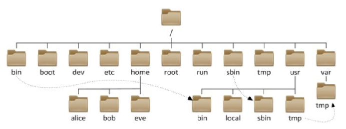
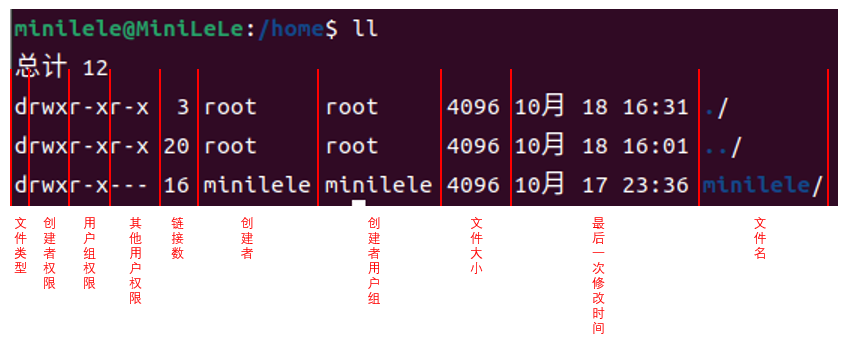

# Linux目录结构



- Linux只有一个顶级目录`/`，路径描述的层次关系同样用`/`来表示
- `home/`目录下包含普通用户的内容，`root/`目录下包含root超级用户的内容
- 文件路径表示方法：
  - 绝对路径：从根目录`/`位置开始描述路径
  - 相对路径：从当前目录位置开始描述路径
    - `./`：当前目录
    - `../`：上级目录
    - `~/`：当前登录用户的HOME目录


# Linux基础命令

## 切换目录

### pwd命令

`pwd`：展示当前工作目录

### ls命令

`ls [-a -l -h] [参数]`：输出目录下文件信息

- 参数：被查看的目录路径，不提供时查看当前工作目录
- -a：显示隐藏文件（以`.`开头的均是隐藏文件）
- -l：以列表形式输出，配合-h可人性化显示

### cd命令

`cd [参数]`：切换工作目录

- 参数：要切换到的目标目录，不提供时默认切换到当前登录用户的HOME目录


## 文件归档

### mkdir命令

`mkdir [-p] 被创建文件夹路径`：创建文件夹

- -p：创建前置路径

### touch命令

`touch 被创建的文件路径`：创建文件

### vim编辑

。。。pass

### cp命令

`cp [-r] 被复制的文件或者文件夹 复制到的文件或者文件夹`：复制文件或文件夹

- -r：复制文件夹时使用

### mv命令

`mv 被移动的文件或者文件夹 移动到的文件或者文件夹`：移动文件或文件夹、修改文件名

### rm命令

`rm [-r -f] 支持通配符*的删除的以空格分隔文件或文件夹路径`：删除文件或文件夹

- -r：删除文件夹使用
- -f：root用户强制删除


## 内容操作

### cat命令

`cat 被查看的文件路径`：全部查看文件内容

### more命令

`more 被查看的文件路径`：翻页查看文件

### tail命令

`tail [-f -<num>] 被查看的文件路径`：查看文件尾部内容

- -<num>：被查看的文件尾部内容的行数
- -f：持续跟踪文件修改

### head命令

`head [-f -n] 被查看的文件路径`：查看文件头部内容

- -<num>：被查看的文件尾部内容的行数
- -f：持续跟踪文件修改

### find命令

`find 起始路径 -name 支持通配符*的关键字 [-size +|- KMG]`：搜索文件路径

- -size：按文件大小查找，+|-代表大于或者小于，KMG代表水平值

### echo命令

`echo 被输出内容`：输出内容

- 被输出内容通常用""包围的，其中的命令字符可用``转义

### 重定向符

`> | >>`：将符号左边的输出存入右边指定的文件

- `>`：表示覆盖输出
- `>>`：表示追加输出

### 管道符|

`|`：将符号左边的输出作为符号右边的输入

### grep命令

`grep [-n] 使用””包围的关键字 过滤内容的文件路径`：过滤关键字

### wc命令

`wc [-l -w -c -m] 被统计文件的路径`：统计

- -l：统计行数
- -w：统计单词数量
- -c：统计bytes数量
- -m：统计字符数量


## 权限管理

### ll命令

`ll`：查看当前工作目录下文件权限



- 对象：文件和文件夹
- 所有者：创建者（user|u），用户组（group|g），普通用户（other|o），`超级用户（root）`
- 文件类型：`-`普通文件、`d`目录文件、`l`软连接…
- 权限：读（r）对应4，写（w）对应2，执行（x）对应1

### chmod命令

`chmod [-R] 权限 被修改的文件或者文件夹`：root或者创建者修改文件或文件夹权限

- 权限
  - 三数字串
    - 0：\-\-\-
    - 1：\-\-x
    - 2：\-w\-
    - 3：\-wx
    - 4：r\-\-
    - 5：r\-x
    - 6：rw\-
    - 7：rwx
  - ugo rwx\-表示，以逗号分隔
    - `权限所有者 +|-|= 权限`

- -R：将权限递归到该文件目录下所有文件

### group用户组

`groupadd  用户组名`：root下创建用户组

`groupdel 用户组名`：root下删除用户组

### user用户

`useradd -m 用户名`、`adduser 用户名`：root下创建用户

`userdel [-r] 用户名`：root下删除用户，-r删除对应HOME用户目录

`id [用户名]`：查看用户属组，默认查看当前登录用户

`usermod -aG 用户组 用户名`：将用户加入指定用户组

### genenv命令

`getenv passwd`：查看系统全部的用户

- 用户名：密码(x)，用户ID，组ID，描述信息(无用):HOME目录:执行终端(bash)

`getenv group`：查看系统全部的用户组

- 组名：组认证(x):组ID

### chown命令

`chown [-R] [用户][:][用户组] 文件或文件夹`：root下修改文件、文件夹所属用户、组

- 默认用户root，默认组root

- -R：将权限递归到该文件目录下所有文件

### su命令

`su [-] [用户]`：切换用户

- `-`：切换后加载环境变量
- 用户默认切换到root

### sudo命令

`sudo 命令`：将命令赋予root权限

- 可以再root下执行`visudo`追加内容用户拥有无密码sudo能力

  ```
  用户名 ALL=(ALL)       NOPASSWD: ALL
  ```


## IP网络

### ip地址

`ifconfig`：查看ip

### hostname主机名

`hostnamectl set-hostname 主机名`：设置系统名称

`hostname`：查看系统名称

### DNS域名解析

优先根据计算机本地域名解析文件hosts进行**域名解析**

### IP固定配置

`sudo vim /etc/netplan/01-network-manager-all.yaml`

```shell
# Ubuntu 20.04
# Let NetworkManager manage all devices on this system
network:
  version: 2
  renderer: NetworkManager
  ethernets:
    ens33:
      dhcp4: no
      dhcp6: no
      addresses: [192.168.242.10/24]
      optional: true
      gateway4: 192.168.242.2
      nameservers:
        addresses: [114.114.114.114,8.8.8.8,192.168.242.2]
```

```shell
# Ubuntu 22.04
# Let NetworkManager manage all devices on this system
network:
  version: 2
  renderer: NetworkManager
  ethernets:
    ens33:
      dhcp4: no
      dhcp6: no
      addresses:
        - 192.168.242.3/24
      routes:
        - to: default
          via: 192.168.242.2
      nameservers:
        addresses:                                                              
          - 192.168.242.2
          - 114.114.114.114

```

`sudo netplan apply`

> 虚拟机联网：
>
> 1. Host-Only：VMnet1 仅主机模式，无互联网连接
>
> 2. NAT：VMnet8 NAT模式：内网地址转换，使用出口路由的公共外网ip进行互联网连接
>
>    > 内部私有地址：
>    >
>    > A类 10.0.0.0--10.255.255.255
>    >
>    > B类 172.16.0.0--172.31.255.255
>    >
>    > C类 192.168.0.0--192.168.255.255
>
> 3. Bridged：VMnet0（局域网）桥接模式，与主机在同一个网段（子网掩码、网关与DNS与主机一致）
>
> IP地址冲突：
>
> 1. 不同内网私有地址可以重复
> 2. 手动设置的固定IP地址重复：冲突
> 3. 内网内设备的公网IP是一致的，但使用不同的端口，即NAT

### 虚拟机挂主机代理

> 如果不想挂代理，可以尝试在国内网中好心人在外国网上下载的文件，再将下载链接重定向到国内网站

1. 虚拟机联网：Bridged或者NAT，主要是为了连上**同一个局域网**
2. 开启**主机代理**，允许**局域网代理**（Allow LAN），查询**主机IP**（ipconfig）和**本地监听端口**（7890）
3. 设置虚拟机网络代理为**手动**，将主机代理软件**代理协议**（HTTP(S)\SOCKS5）对应IP和端口填为主机IP和本地监听端口即可

注意：虚拟机终端不走代理，要想终端代理：加入环境变量，**具体要看终端要执行的命令走的是哪种网络协议以及`proxyAddress`是从主机IP出发还是localhost：127.0.0.1**，这里建议多次尝试（有时要求**主机代理开全局**）

1. 设置代理`setproxy`
   - `export  <protocols>_proxy=<protocols>://proxyAddress:port `
   - `export HTTPS_PROXY=socks5(h)://proxyAddress:port`、`curl https://www.google.com`，socks5适合本地能够解析目标主机域名(github.com)但是访问速度慢,来提高下载速度，socks5h用与本地不能解析目标主机域名(google),由代理服务器解析目标主机域名
   - `curl -x socks5h://proxyAddress:port www.google.com`
2. 取消代理`unsetproxy`
   - `unset <protocols>_proxy`
3. 验证代理
   - `curl cip.cc`

> 原理：让虚拟机和主机处于同一个局域网(网络号一致，一般同一网关)中，将虚拟机中的流量转发到主机上，主机的代理软件监听到局域网内的请求，再将流量转发到代理服务器中

### ping命令

`ping [-c <num>] ip地址`：测试网络是否联通

- -c：检查次数，默认无限次

### wget命令

`wget [-b] <url>`：下载网络文件

- -b：后台下载，日志写入`tail -f wget-log`

### curl命令

`curl [-O] <url>`：发送网络请求（下载文件、获取信息）

- -O：若为下载url可保存相关文件

### nmap命令

`nmap ip地址(本机127.0.0.1)`：查看所有端口占用情况

### netstat命令

`netstat -anp | grep 端口号`：查看指定端口号占用情况

### sar命令

`sar -n dev 刷新间隔 刷新次数`：查看网络（网卡）接口统计


## 进程管理

### ps命令

`ps -ef | grep 进程ID`：查看全部进程信息，

### kill命令

`kill [-9] 进程ID`：强制关闭进程

### top命令

`top`：查看主机运行状态基础信息（任务管理器）

### df命令

`df -h`：查看磁盘占用

### iostat命令

`iostat -x 刷新间隔 刷新次数`：查看CPU、磁盘的相关信息


## 更多内容

> 可以通过`命令 --help`查看命令的帮助手册
>
> 可以通过`man 命令`查看某命令的详细手册

### which命令

`which 被查看的命令`：查看命令程序本体文件路径

### CTRL+R快捷键

快捷匹配历史命令

### clear命令

`clear`\\`CRTL+L`：清屏


# Linux常用操作

## apt软件安装

`apt [install remove search] [-y] 软件名称`：Ubuntu系统root下安装软件

- -y，自动确认


## systemctl服务控制

`systemctl start | stop | restart | disable | enable | status 服务名`：控制系统服务


## ln软链接

`ln -s 被链接的内容 链接到的位置`：创建文件或文件夹软链接（快捷方式）


## date日期

`date [-d "+|- <num> 单位"] ["+格式化字符串"] `：查看日期

- -d：日期计算，单位包括year、month、day、hour、minute、second

- 格式化字符串：
  - %Y   年
  - %y   年份后两位数字 (00..99)
  - %m  月 
  - %d   日
  - %H   小时
  - %M   分钟
  - %S   秒
  - %s   自 1970-01-01 00:00:00 UTC 到现在的秒数

> root下修改时区：`rm -f /etc/localtime` & `ln -s /usr/share/zoneinfo/<Address> /etc/localtime ` 
>
> 同步时间：`systemctl start ntpd` & `ntpdate -u ntp.aliyun.com`


## 环境变量

> `env`：查看系统全部的环境变量
>
> `${环境变量名}字符串`：取出指定的环境变量的值
>
> 记录操作系统中一些特殊对象名对应的内容

- 临时设置：`export 变量名=变量值`、临时删除：`unset 变量名`

  > 临时仅局限于当前时空下的shell

- 永久设置、删除：
  - 针对用户，设置用户HOME目录内：`.bashrc`文件
  - 针对全局，设置`/etc/profile`
  - 永久生效：`source 文件路径`


### PATH变量

记录执行程序的搜索路径：可以将自定义路径加入PATH内，实现自定义命令在任意地方均可执行的效果


## 上传下载

`rz`：Xshell中上传到Linux

`sz 路径`：Xshell下载Linux内容到Windows


## 压缩解压

`tar -zcvf 压缩包 压缩内容1 压缩内容2 ... 压缩内容N`：压缩文件

`tar -zxvf 被解压的文件 [-C 解压位置]`：解压文件

- -z表示使用gzip变为`.tar.gz`文件，不写则为`.tar`文件

`zip [-r] 压缩包 压缩内容1 压缩内容2 ... 压缩内容N`：压缩文件

- -r：压缩内容包含文件夹

`unzip [-d 解压位置] 压缩包文件`：解压文件


## 清理安装包

`sudo apt autoremove`：清理安装包
