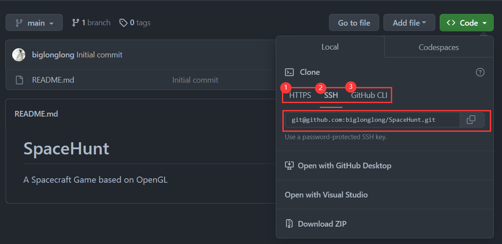

# 零、配置

> 本地Git仓库和GitHub仓库间**通过SSH加密传输**，使用前需先配置ssh key建立连接

- 安装git

- git bash设置机器标识

  ```
  git config --global user.name "GitHub_ID"
  git config --global user.email "GitHub_Email"
  ```

- 创建[私钥](.\User \.ssh\id_rsa)

  ```
  ssh-keygen -t rsa -C "GitHub_Email"
  ```

- Github连接：github -> Account settings -> SSH and GPG keys->New SSH key；[write key_title and paste Private Key just now]

- git bash 验证配置成功

  ```
  ssh -T git@github.com
  ```

- 设置偏好config，具体内容自行搜索攻略

  ```
  git config --system  <property> “selection”
  git config --global  <property> “selection”
  //手动操作C:\Users\Administrator\.gitconfig或.\.git\config   export property=selection
  ```
  


# 一、项目发布

## New in Github


- Repository name: 仓库名称
- Description: 仓库描述介绍(可选)
- Public, Private : 仓库权限（公开共享，私有或指定合作者）
- Initialize this repository with a README: 基于Description添加一个README.md 
- gitignore: 不需要进行版本管理的仓库类型，对应生成文件.gitignore
- license: 证书类型，对应生成文件LICENSE



- 选择一个远程仓库地址，三选一，待会要用


## New Located

- 创建一个项目文件夹（名字无所谓，不影响后续内容）

```
cd Desktoop
mkdir demo
cd demo
...
```

- 在项目文件夹中开发…

## Up to Github

- 创建本地版本库，默认分支为master

  ```
  git init
  git add .
  git commit -m ""
  ```

- 修改分支名为main

  ```
  git branch -m master main
  ```

- 建立本地项目（分支）与github项目（分支）的连接，将之前的远程地址称为origin（你可以自定义）

  ```
  git remote add origin git@github.com:biglonglong/<project>.git
  ```

- 建立分支的upstream（只在第一次需要这么做，之后直接push即可）

  ```
  git push -u origin main
  ```


# 二、合作开发

## 关于权限

- Authority：除仓库owner，要想让其他成员拥有仓库上传权限，需将其添加到项目成员目录中，否则只能进行**Pull Request**：
  - Fork：从原作者仓库fork，建一个自己的分支仓库
  - Clone：将fork的仓库clone到本地dev分支开发并push
  - Pull request：Github服务端显示修改并产生Pull request链接，Pull request并注明修改内容与冲突关系，与原作者在该Pull request下进行Comment
  - Merge request：等待原仓库的作者查看和决定是否接受修改，原作者与fork成员Comment后点击Merge request即可

## 关于分支

- 开发者在本地仓库创建新分支开发，提交后在远端也形成新分支；远程仓库分支名与本地仓库分支名是**统一**的

- git push可认为是远程仓库分支**合并**本地仓库对应的分支；如果远程仓库没有对应分支，则创建一个新的空分支进行合并；对应的git pull可认为是本地仓库对应的分支合并远程仓库分支
- Github上默认分支为main，git上**默认**分支为master；由于历史原因，某些情况下本地仓库master分支与远程仓库main分支不冲突时，两者会合并为远程仓库main分支

## 关于冲突

### 下拉冲突

> ```
> git pull origin main
> ```
>
> Error：`refusing to merge unrelated histories`

1. 允许冲突下拉：

   ```
   git pull origin main --allow-unrelated-histories
   ```

   `Your local changes to the following files would be overwritten by merge`，产生冲突

2. 进入文件修改冲突后：

   ```
   git add .
   git commit -m "changes"
   ```

1. 再提交即可

   ```
   git push -u origin main
   ```

### 合并冲突

> 不同开发者在本地仓库不同分支同步开发v1.0、v1.1、v1.2，检出项目`git clone ...`，默认只检出main主分支`git branch -a`，检出v1.0、v1.2分支`git checkout v1.0 & git checkout v1.2`
>
> 最终项目需要1.0已经增加的功能先合并到1.2

1. v1.2分支上合并分支v1.0分支

   ```
   git checkout v1.2
   git merge v1.0
   ```

2. 解决冲突，提交冲突，提交v1.2分支

   ```
   vim ...
   git add .
   git commmit -m "conflict"
   git push origin v1.2
   ```

3. 删除多余分支

   ```
   // 删除远程分支
   git push origin --delete v1.0
   // 强制删除本地分支
   git checkout v1.2
   git branch -D v1.0
   ```


# 三、开发模板

```
==================< 1.创建本地工作分支work，修改目标文件并提交到本地work分支 >===================
$ git init
$ git branch work     #创建工作分支work
$ git checkout work   #切换到工作分支work
$ vim /.../1.txt   #修改1.txt内容
$ git add /.../1.txt
$ git commit -m "modify in branch work"  #提交到本地work分支


===========================< 2.切换到main分支，拉取最新代码>===============================
$ git checkout main    #重新切换到main分支
$ git pull origin main   #拉取服务器main分支代码


======================< 3.切换到work分支进行rebase/merge并进行冲突解决 >======================
$ git checkout work   #再次切换到work分支
$ git rebase main  #将work分支rebase到main分支上

$ vi 1.txt     #上一步合并有冲突，所以手动修改(merge)文件
$ git add 1.txt   #变基的临时分支，直接git add将修改加进暂存区
$ git rebase --continue    #使用continue选项继续前面的rebase
# 也可以执行"git rebase --skip" 命令跳过这个提交。
# 如果想终止执行并回到"git rebase" 执行之前的状态，执行 "git rebase --abort"。


======================< 4.切换到main分支进行merge并提交到远程服务器 >========================
$ git checkout main #切换到分支 'main'，您的分支与上游分支 'origin/main' 一致。
$ git merge work 
$ git push origin main 
```


# 四、版本回退

```
git hist  # 寻找历史版本<hash>（及时git tag <hash>）
git checkout <hash>  # 版本切换进行查看
git reset --hard <hash>  # 还原到任意一次提交
git push -f origin main  # 强制覆盖远程仓库
```

如何撤回本地的add和commit呢？


# 五、其他问题

## 1.CRLF换行符

> 现象：（跨平台）工作空间commit项目时**Warning:LF will be replaced by CRLF**，再次clone后文件乱码
>
> 原因：换行主要与CR回车`\r`、LF换行`\n`相关，文件行尾的换行符在不同编辑器和不同平台下具有不同的表示：Linux和macOS使用LF换行，而Dos和Windows使用CR LF换行，在编辑器中体现为KEY `Enter`

- 更改`git config --global|system|local`

单独开发的程序员：

```bash
#提交检出均不转换
$ git config --global core.autocrlf false
```

多人协作跨平台开发的window程序员：

```bash
#提交时转换为LF，检出时转换为CRLF
$ git config --global core.autocrlf true
```

多人协作跨平台开发的Linux程序员：

```bash
#提交时转换为LF，检出时不转换
$ git config --global core.autocrlf input
```

为了防止文换行符杂糅，设置检查：

```bash
#拒绝提交包含混合换行符的文件
git config --global core.safecrlf true   
#允许提交包含混合换行符的文件
git config --global core.safecrlf false
#提交包含混合换行符的文件时给出警告
git config --global core.safecrlf warn
```

- 项目文件`.gitattributes`（最高优先级），文件内容格式为`支持*的文件作用域 属性...`，常用属性：

1. text：标记为文本文件
2. -text：标记为非文本文件
3. text=auto：标记为文本文件并行尾规范化，默认将为新加入项目文件行尾设置为LF
4. eol=crlf：行尾规范化，出库时转为CRLF，入库转为LF
5. eol=lf：行尾规范化，入库转为LF，出库时不操作
