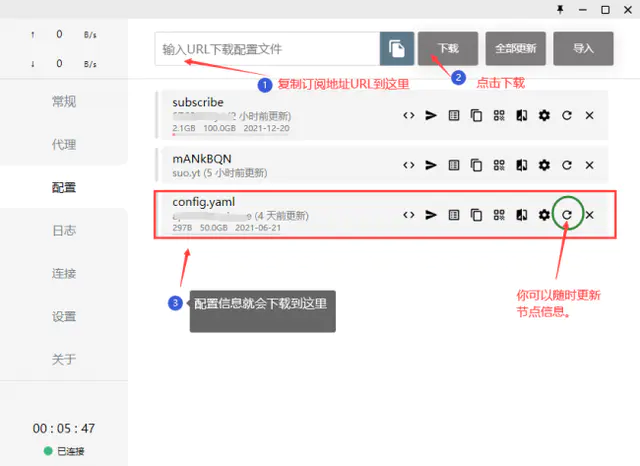
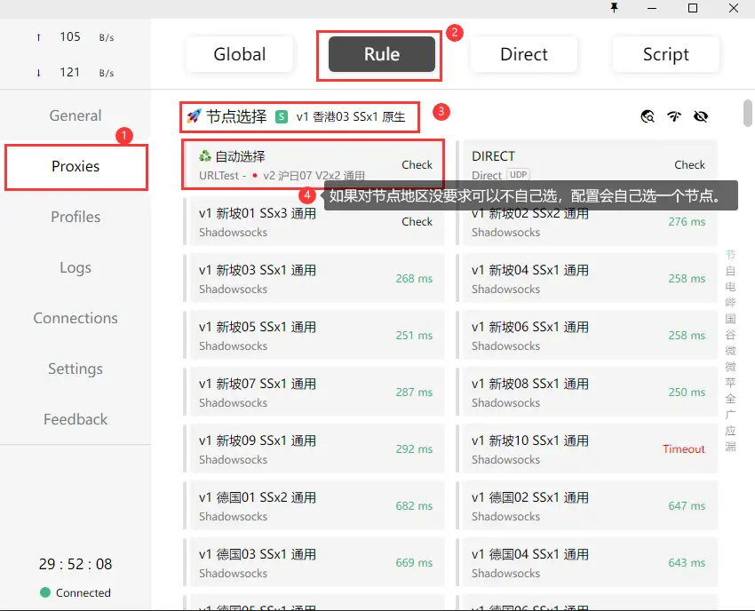
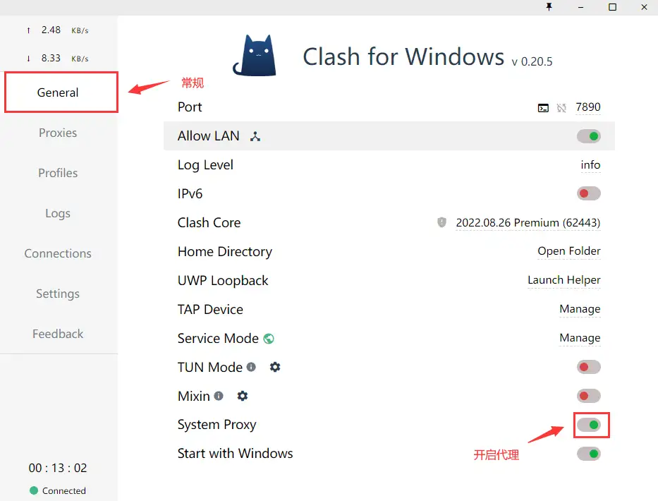

# 代理软件

> Clash是基于规则的跨平台**代理软件**核心程序
>
> Clash for Windows通过 Clash API 来配置和控制 Clash 核心程序，方便新手**挂代理**
>
> 具体下载见[Clash官网](https://github.com/Dreamacro/clash)

假设我们已经拥有了一个叫做==订阅地址==/==订阅链接==/[配置].yml的东西

- 打开 Clash for Windows，进入(Profiles)配置，如下操作，操作之后也可点击**全部更新**：

- 切换到 proxies（代理），单击类似WiFi的图标可查看延迟，选择你的节点，用鼠标点下即可

> 全局（Global）：所有请求直接发往代理服务器
>
> 规则（Rule）：所有请求根据配置文件规则进行分流
>
> 直连（ Direct ）：所有请求直接发往目的地

- 点击常规,打开系统代理和开机启动两项即可。如果需要局域网共享可以打开允许局域网连接，默认是关闭。

现在你想怎么可以climb WALL了。

> 上不了网?
>
> - 方法一：删除先前的配置文件，然后通过 url 重新下载就可以解决问题了。
> - 方法二：在任务栏的搜索框中输入“cmd”，右键点击命令提示符，选择以管理员身份运行，在管理员：命令提示符窗口中执行以下的命令：netsh winsock reset 回车。然后重启电脑，再开 clash，Ok
> - 方法三：打开系统设置—-网络和 Internet 设置—-关闭代理，退出 clash,在重启 clash 即可。
> - 方法四：火绒断网修复
>
> 不能用 line 或 tiktok？
>
> 共享线路不一定能用 line 或 tiktok 等对 ip 要求较高的应用。这是应用运营商的限制，与我们没关系。如需稳定运营对应软件，建议定制独享节点，详细报价请工单咨询（这个你要花钱！！）

# 节点订阅

> 如何为Clash**订阅地址**

- [觅云](https://www.miyun.la/)
- [一元机场](https://xn--4gq62f52gdss.com/#/login)
- [sockboom](https://sockboom.tv/)
- [wenpblog](https://www.wenpblog.com/)

> - [Poe - Fast, Helpful AI Chat](https://poe.com/login?redirect_url=%2FChatGPT)
> - [FASTLINK (fastlink-aff02.com)](https://v2.fastlink-aff02.com/auth/login)
> - [FastVPN - Private and Secure VPN Service](https://www.namecheap.com/vpn/)
> - [💬1 - 魔戒.net (mojie.vip)](https://www.mojie.vip/#/login)
> - [jyj0912/Free-clash](https://github.com/jyj0912/Free-clash)
> - [glados.rocks/register](https://glados.rocks/register)

其他参考

- host（修改主机host直连文件）
  - [Github最新hosts-每日更新](http://blog.yoqi.me/lyq/16489.html)
- 虚拟验证
  - [(5sim.net)](https://5sim.net/zh/free)

