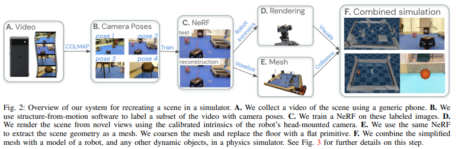
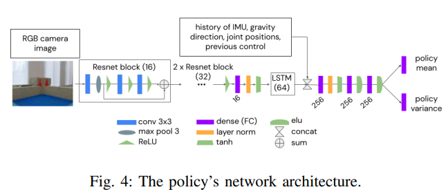
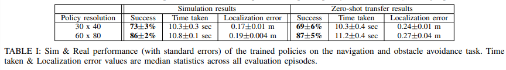
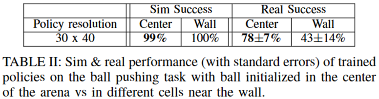

# [ICRA2023-NeRF2Real: Sim2real Transfer of Vision-guided Bipedal Motion Skills using Neural Radiance Fields](https://sites.google.com/view/nerf2real/home)

## 介绍

机器人控制策略的训练，目前比较流行的一种模式：在仿真环境下进行大规模深度强化学习，再将其转移到真实机器人中进行测试。这种方法避免了许多问题，如状态估计、安全性和数据效率等。因此，问题的关键在于如何简单高效地进行sim2real(仿真)，重现真正场景,使用成熟的系统建模工具效果堪忧，而使用深度RGB相机限制了方法的普适性。论文的贡献如下：

- 采用神经辐射场（NeRF）描述了一种生成复杂静态场景仿真模型的系统，将NeRF学到的静态几何场景与动态物理仿真相结合。NeRF是一类场景表示方法，可以从稀疏的输入视图中（环境视频或照片）合成该仿真环境下其他视图。
- 将机器人的物理精确仿真放置于仿真环境中进行深度强化学习，训练基于视觉的全身导航和推球策略。

## 实现方法

- 构建静态物体和动态物体相结合的仿真环境

- 机器人强化学习

网络结构：视觉和本体感觉作为输入。网络由一个递归图像编码器组成，该编码器将摄像头图像通过一个小型ResNet后再通过一个LSTM；编码后与过去五次本体感觉的历史记录相结合，通过MLP输出一个对角高斯，对其采样得到动作。

奖励与惩罚：只要机器人的偏航角速度大于Π rad/s就受到惩罚，鼓励缓慢运动防止摔倒；最小化目标区域与球之间的距离；如果球没有向目标移动。最小化球与机器人的距离…

## 实验结果

- 导航避障

1. 学到的策略再模拟和真实机器人上的表现无明显差异
2. 失败情况中一半是由于碰撞或摔倒，一半是由于定位不准

- 推球任务

模拟和实际的差距较大，球经常会卡在墙壁附件，机器人很难移动

## 讨论与局限性

1. 作者提出了一种较好的方法，即NeRF2Real进行sim2real的任务，但该方法只是半自动化，步骤中还需要一些成熟工具和人工调整处理；但随着未来NeRF模型的发展，这种应用技术也会得到进步。

2. 这项研究提出了一种通用机器人系统训练视觉引导策略的方法。虽然该方法的形式不太可能在现实世界中实现全自动化应用，但未来的研究可能会使一系列造福人类的应用成为可能。