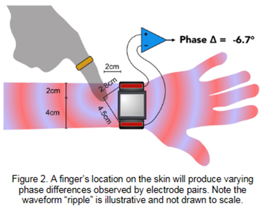
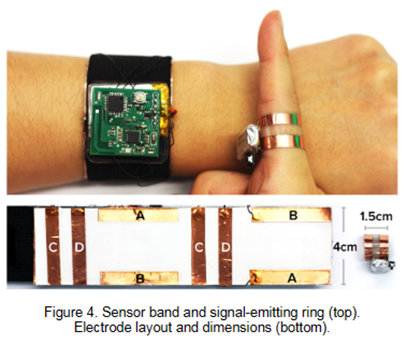
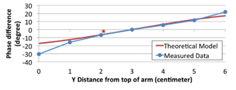
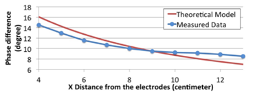
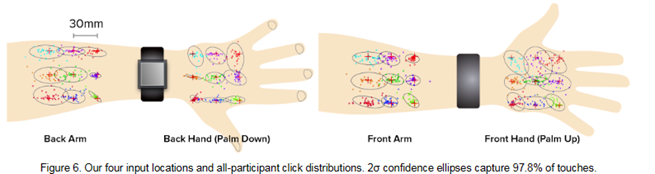
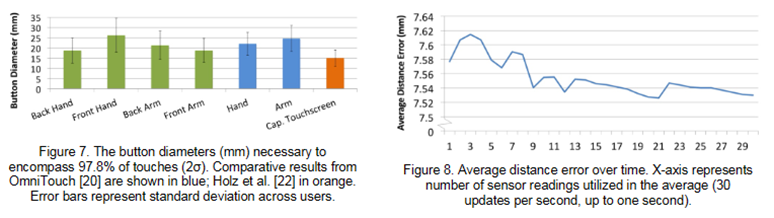
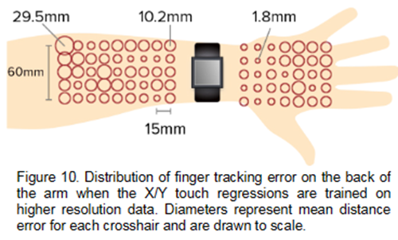

# [CHI2016-SkinTrack: Using the Body as an Electrical Waveguide for Continuous Finger Tracking on the Skin](https://dl.acm.org/doi/10.1145/2858036.2858082#sec-supp)

## 介绍

小型穿戴设备 如智能手表等 正迅速流行，但其小尺寸特性一直限制了用户体验，探讨如何利用设备周围的区域来开启更大的输入模式是非常有意义的。论文的贡献如下：

- 避免直接在输入区域安装仪器或过于突兀的设备，同时提高触摸感应能力，提出一种新颖的传感方法SkinTrack，即将皮肤用作交互式触摸跟踪表面，包含两个组件，一个是佩戴在手指上发射不易察觉、无害的交流信号的戒指；另一个是戴在手臂上带有结构化电极的腕带。当用户的手指接触皮肤时，电信号沿手臂向外辐射，而信号传播需要一定时间，接着电信号被位于手腕不同位置的多对电极对接收，通过信号相位差反向计算出信号源（即手指）的位置，从而实现对皮肤的实时触摸的跟踪。
- 通过电极排列方式、Mylar薄膜、终端电阻、高通滤波器等细节得到很高的信噪比和能效比，进而得到系统很高的可靠性和准确性。

## 实现方法

原理：电磁波沿物理波导传播，而手臂恰能为电信号作为一种波导

过程：

- 两个硬件：在人体中，**80MHz**电磁波每传播1cm，相位差约4°；如上图所示，手指在某处接触皮肤，该位置据两个电极的距离的差约1.7cm，这就会导致6.7°的相位差（通过相位比较器确定）；
- 机器学习：**分类**目标-是否对皮肤触摸à**回归**目标-跟踪触摸点
  - 以四个增益比和四个相位差以及由此衍生的统计数据作为特征集
  - 分类（SVM）是否接触
  - 划分手臂区域形成十字线矩阵作为标签集
  - 回归  （SMO、RBF）分别来预测X位置和Y位置

【优点：可以针对每个人体质特质对分类与回归参数进行自适应的调整】

## 实验结果

- 相位差对比实验

- 用户体验评估实验

- 产品对比（OmiTouch、电容式触摸屏）

- 高分辨率实验

- 拓展实验（以下结果准确率都较高）
  - 分类器：未接触、悬停、接触（衍生更多的应用）
  - 分类器：前臂、后臂、前手、后手（不可随意更换戴戒指的手指）
  - 其他可能影响因素
  - 毛发浓密程度有一定影响
  - 绝缘层（衣服）基本无影响
  - 皮肤保湿情况基本无影响

## 讨论与局限性

- 传感的时间稳定性----快速校准（自适应处理必要）
- 发射环的持续供电----动态激活
- 手指按压的物理接触条件---更多的降噪处理
- 低水平磁场与疾病之间的联系
- 信号源对其他设备的干扰