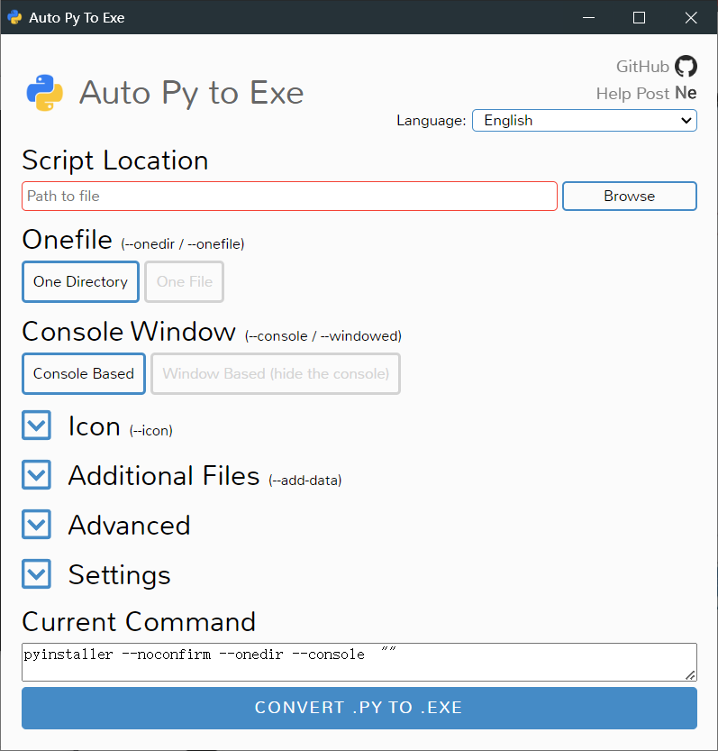

> 可视化神器：Auto-py-to-exe
>
> 基于python环境和Pyinstaller，一个用于将Python程序打包成可执行文件的图形化工具


# 安装

确保大于或等于2.7的Python环境，打开cmd

```bash
pip install auto-py-to-exe
```

启动auto-py-to-exe

```bash
auto-py-to-exe
```




# 使用

1. Script Location：指定要打包的Python脚本
2. Onefile：One Directory打包成文件夹，One File打包成exe
3. Console Window：Console Based显示程序运行命令行，Window Based (hide the console)相反，但容易出现问题
4. Icon：打包程序图标
5. Additional Files：程序依赖文件
6. Advanced / Settings：其他选项