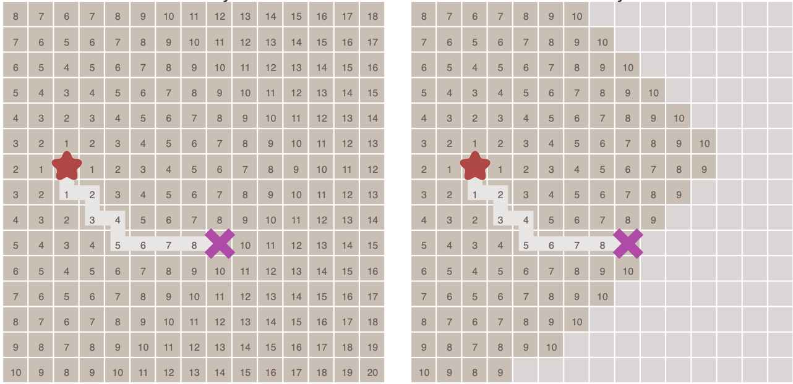
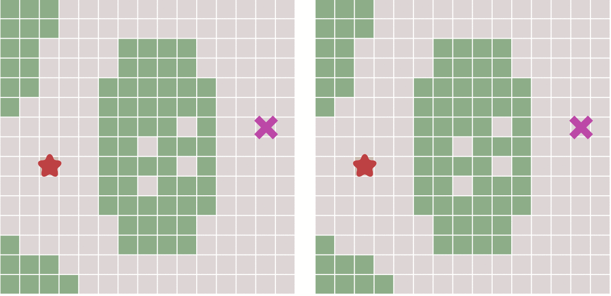
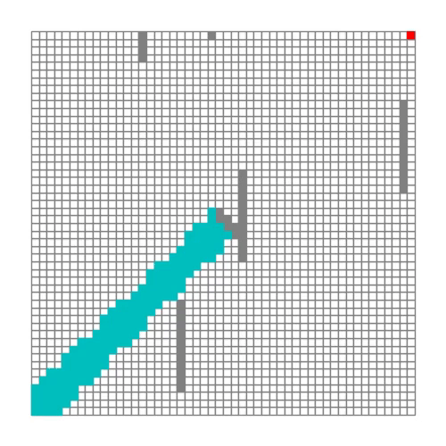
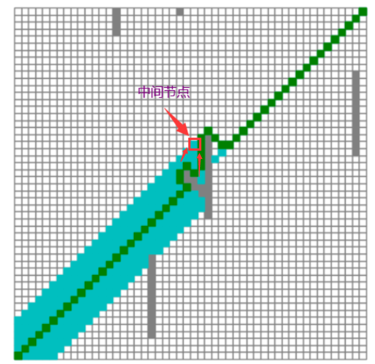
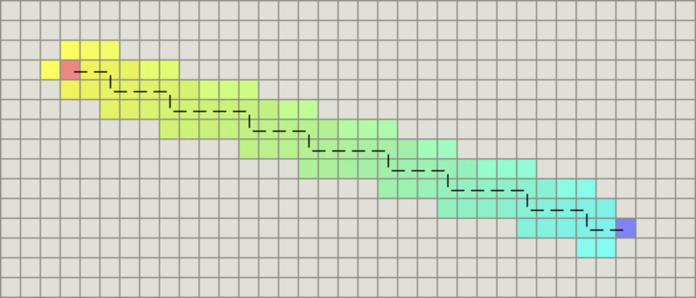
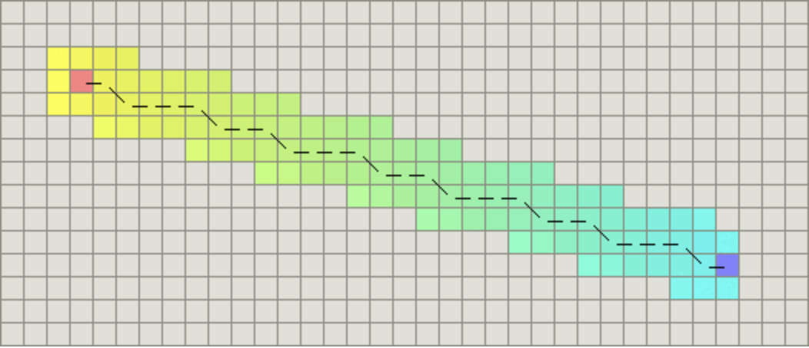
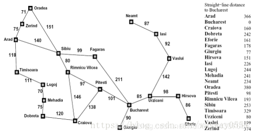

[如果你已经有了基础认识，可以直接看这里](#这里)


# 普通搜索算法

> 路径查找和图形遍历


## 广度优先搜索

- 以**广度做为优先级**进行搜索

**Flood fill**：从起点开始，首先遍历起点周围邻近的点，然后再遍历已经遍历过的点邻近的点，逐步的向外扩散，直到找到终点。


在上面这幅动态图中，算法遍历了图中所有的点，这通常没有必要。对于有明确终点的问题来说，一旦到达终点便可以提前终止算法，下面这幅图对比了这种情况：



在执行算法的过程中，**每个点需要记录达到该点的前一个点的位置** – 可以称之为父节点。这样做之后，一旦到达终点，便可以从终点开始，反过来顺着父节点的顺序找到起点，由此就构成了一条路径。

------


## Dijkstra算法

> 单源最短路径

贪心：从起点到任何一点之间存在代价，我们总是认为**当前最近的一点的代价为该点的最小代价**（因为该点最小代价是基于前x点最小代价得出的，而前x个最小代价都比该代价小才有可能使得该点产生更小代价，而其他点不会导致更小代价）



上面对比了不考虑节点移动代价差异的广度优先搜索与考虑移动代价的Dijkstra算法的运算结果：

> 当图形为网格图，并且每个节点之间的移动代价是相等的，那么Dijkstra算法将和广度优先算法变得一样。

------


## 最佳优先搜索

> 优先队列

限界函数：预先计算队列中节点到达终点的代价，选择代价最小（离终点最近）的节点作为下一个节点


但这种算法会不会有什么缺点呢？答案是肯定的。

因为，如果起点和终点之间存在障碍物，则最佳优先算法找到的很可能不是最短路径，下图描述了这种情况。


------


# ==A*算法==

**节点的优先级:**
$$
f(n)=g(n)+h(n)
$$

- f(n)是节点n的**综合优先级**。当我们选择下一个要遍历的节点时，我们总会选取综合优先级最高（值最小）的节点
- g(n)是节点n距离起点的**当前最小代价**，这一点类似于Dijkstra
- h(n)是节点n距离终点的**预计代价**，这一点类似于最佳优先搜素的启发函数


A*算法使用两个集合来表示待遍历的节点，与已经遍历过的节点，这通常称之为`open_set`和`close_set`。


### 这里

完整的A*算法描述如下：

```
* 初始化open_set和close_set；
* 将起点加入open_set中，并设置优先级为0（优先级最高）；
* 如果open_set不为空，则从open_set中选取优先级最高的节点n：
    * 如果节点n为终点，则：
        * 从终点开始逐步追踪parent节点，一直达到起点；
        * 返回找到的结果路径，算法结束；
    * 如果节点n不是终点，则：
        * 将节点n从open_set中删除，并加入close_set中；
        * 遍历节点n所有的邻近节点：
            * 如果邻近节点m在close_set中，则：
                * 跳过，选取下一个邻近节点
            * 如果邻近节点m也在open_set中，则：
                * 对比open_set中的与邻近节点对应的节点
                	* 若当前路径能比open_set中的节点产生更小的g(n)
                		* 修改parent中的g(n)、f(n)、parent
            * 如果邻近节点m也不在open_set中，则：
            	* 将节点m加入open_set中
                * 设置节点m的g(n)、h(n)、f(n)、parent
   
```

> 总结：优先选择总代价最小的点，对该点进行宽度优先搜索
>
> - 儿子节点x在close_list中，则不必再对儿子节点进行更新（parent、g、f）和扩展
>
>   - 该次产生儿子节点x的父节点必然是具有更大的g(n)（这一点由优先选择总代价最小的节点决定），也即f(n)（对于某个中间节点而言，其预估代价h(n)是确定的，所以f(n)仅取决于g(n)），因此该父节点到儿子节点的路径必然不是最佳路径。
>   - 该儿子节点之前作为父节点成为死节点后才出现在close_list中，即减少重复操作
>
> - 儿子节点x在open_list中，说明此时到达儿子节点存在两条路径
>
>   - 一条是此次父节点产生儿子节点对应的路径
>
>   - 另一条是之前其他父节点也产生了同样的儿子对应的路径（这里是因为之前的父节点比现在的父节点具有更高的优先级，但并不代表如今的儿子节点优先级更低，这一点将会在下面将要讲到的存在障碍物的路径搜索题中体现得淋漓尽致）
>
>   - 因此对于到达儿子节点的路径，我们需要择优处理，选择更好的g、f、parent
> - 儿子节点x不在open_list中
>   - 创建儿子节点（g、h、f、parent）加入open_list中

如果【儿子节点x在open_list中】的情况不考虑的话，结果如下：



在经过Y型阻碍的过程中，由于向内的路径具有更小的代价，算法优先选择向内的路径作为父节点parent



事实上，从Y的顶尖的一遍到另一边应该是直线距离最短（尽管每个方格的代价是$\sqrt{2}$）,这是由于在到达中间节点时未考虑到达中间节点的最优路径导致的（这个时候仍然用到达目标节点最小代价的parent），也就是说对于不同parent产生的相同儿子节【儿子节点x在open_list中】，我们需要进行对比择优

> ==attention==:g(n)是节点n距离起点的代价，也就是算法会尽量选择距离起点更近的路径；h(n)是节点n距离终点的预计代价，也就是说h(n)某节点到达目标节点的选择具有很强的指导意义：考虑到某些应用场景存在==必经节点==，我们可以通过大大减小该节点h(n)代价的方式，使得算法优先考虑使用该节点作为中间节点的路径


==在整个过程中，我们顺便将每一点的最佳路径都有生成==


## 启发函数

$$
f(n)=g(n)+h(n)
$$

- 如果h(n) 始终小于等于节点n到终点的代价，则A*算法保证一定能够找到最短路径。但是当h(n) 的值越小，算法将遍历越多的节点，也就导致算法越慢。
  - 在极端情况下，当启发函数h(n) 始终为0，则将由g(n) 决定节点的优先级，此时算法就退化成了Dijkstra算法。
- 如果h(n) 完全等于节点n到终点的代价，则A*算法将找到最佳路径，并且速度很快。可惜的是，并非所有场景下都能做到这一点。因为在没有达到终点之前，我们很难确切算出距离终点还有多远。
- 如果h(n) 的值比节点n到终点的代价要大，则A*算法不能保证找到最短路径，不过此时会很快。
  - 在另外一个极端情况下，如果h(n) 相较于g(n) 大很多，则此时只有h(n) 产生效果，这也就变成了最佳优先搜索。

> 通过调节启发函数我们可以控制算法的速度和精确度。因为在一些情况，我们可能未必需要最短路径，而是希望能够尽快找到一个路径即可。这也是A*算法比较灵活的地方。
>


## 关于距离

### 曼哈顿距离

如果图形中只允许朝上下左右四个方向移动，则启发函数可以使用曼哈顿距离，它的计算方法如下图所示：



计算曼哈顿距离的函数如下，这里的D是指两个相邻节点之间的移动代价，通常是一个固定的常数。

```
function heuristic(node) =
    dx = abs(node.x - goal.x)
    dy = abs(node.y - goal.y)
    return D * (dx + dy)
```

### 对角距离

如果图形中允许斜着朝邻近的节点移动，则启发函数可以使用对角距离。它的计算方法如下：



计算对角距离的函数如下，这里的D2指的是两个斜着相邻节点之间的移动代价。如果所有节点都正方形，则其值就是√2*D。

```
function heuristic(node) =
    dx = abs(node.x - goal.x)
    dy = abs(node.y - goal.y)
    return D * (dx + dy) + (D2 - 2 * D) * min(dx, dy)
```


### 欧几里得距离

如果图形中允许朝任意方向移动，则可以使用欧几里得距离。

欧几里得距离是指两个节点之间的直线距离，因此其计算方法也是我们比较熟悉的：$\sqrt{(p2.x-p1.x)^2+(p2.y-p1.y)^2}$

```
function heuristic(node) =
    dx = abs(node.x - goal.x)
    dy = abs(node.y - goal.y)
    return D * sqrt(dx * dx + dy * dy)
```


# 算法实现

> 在一个二维的网格图形上从起点找寻终点的求解过程
>

[a-star-algorithm](a-star-algorithm)

## 坐标点与地图

首先，我们创建一个非常简单的类来描述图中的点:

```python
# point.py

class Point:
    def __init__(self, x, y):
        self.x = x
        self.y = y
        self.basecost = None
        self.heuristiccost =None
        self.totalcost =None
        '''
        # self.totalcost = self.basecost+self.heuristiccost
        try to fix totalcost following basecost & heuristiccost
        but no function
        '''
        self.parent = None
```

接着，我们实现一个描述地图结构的类。为了简化算法的描述:

为了让算法更有趣，我们在地图的中间设置了一个障碍，并且地图中还会包含一些随机的障碍。

```python
# random_map.py

import numpy as np

import point

class RandomMap:
    def __init__(self, size=50):
        self.size = size
        self.obstacle = size//8
        self.GenerateObstacle()

    def GenerateObstacle(self):
        self.obstacle_point = []
        self.obstacle_point.append(point.Point(self.size//2, self.size//2))
        self.obstacle_point.append(point.Point(self.size//2, self.size//2-1))


        # Generate an obstacle in the middle
        for i in range(self.size//2-4, self.size//2):
            self.obstacle_point.append(point.Point(i, self.size-i))
            self.obstacle_point.append(point.Point(i, self.size-i-1))
            self.obstacle_point.append(point.Point(self.size-i, i))
            self.obstacle_point.append(point.Point(self.size-i, i-1))

        for i in range(self.obstacle-1):
            x = np.random.randint(0, self.size)
            y = np.random.randint(0, self.size)
            self.obstacle_point.append(point.Point(x, y))

            if (np.random.rand() > 0.5): # Random boolean
                for l in range(self.size//4):
                    self.obstacle_point.append(point.Point(x, y+l))
                    pass
            else:
                for l in range(self.size//4):
                    self.obstacle_point.append(point.Point(x+l, y))
                    pass

    def IsObstacle(self, i ,j):
        for p in self.obstacle_point:
            if i==p.x and j==p.y:
                return True
        return False
```

这段代码说明如下：

1. 构造函数，地图的默认大小是50x50；
2. 设置障碍物的数量为地图大小除以8；
3. 调用`GenerateObstacle`生成随机障碍物；
4. 在地图的中间生成一个斜着的障碍物；
5. 随机生成其他几个障碍物；
6. 障碍物的方向也是随机的；
7. 定义一个方法来判断某个节点是否是障碍物；


## 算法主体

这里我们通过一个类来封装我们的算法。

首先实现一些算法需要的基本函数：

```python
# a_star.py

import os
import sys
import time
import numpy as np
from matplotlib.patches import Rectangle

import point
import random_map

class AStar:
    def __init__(self, map,target_x,target_y):
        self.map=map
        self.open_set = []
        self.close_set = []
        self.target_x=target_x
        self.target_y=target_y

    # Distance to end point;it is evaluation;need negative number
    def HeuristicCost(self, p):
        x_dis = abs(self.target_x - p.x)
        y_dis = abs(self.target_y - p.y)
        return x_dis + y_dis + (np.sqrt(2) - 2) * min(x_dis, y_dis)

    def NextCost(self,p,parent):
        nextcost=np.sqrt(2)
        if abs(parent.x-p.x)-abs(parent.y-p.y):
            nextcost=1
        return nextcost
    
    def IsValidPoint(self, x, y):
        if x < 0 or y < 0:
            return False
        if x >= self.map.size or y >= self.map.size:
            return False
        return not self.map.IsObstacle(x, y)

    def IsInPointList(self, p, point_list):
        for i,point in enumerate(point_list):
            if point.x == p.x and point.y == p.y:
                return i
        return -1

    def IsInOpenList(self, p):
        return self.IsInPointList(p, self.open_set)

    def IsInCloseList(self, p):
        return self.IsInPointList(p, self.close_set)

    def IsStartPoint(self, p):
        return p.x == 0 and p.y ==0

    def IsEndPoint(self, p):
        return p.x == self.target_x and p.y == self.target_y

    def SaveImage(self, plt):
        millis = int(round(time.time() * 1000))
        figure_save_path = "res_png"
        if not os.path.exists(figure_save_path):
            os.makedirs(figure_save_path)
        filename = './' + str(millis) + '.png'
        plt.savefig(os.path.join(figure_save_path , filename))

    def ProcessPoint(self, x, y,parent):
        # Do nothing for invalid point
        if not self.IsValidPoint(x, y): return
        p = point.Point(x, y)

        # Do nothing for visited point
        if self.IsInCloseList(p) != -1: return 

        if self.IsInOpenList(p) !=-1:
            index = self.IsInOpenList(p)
            p=self.open_set[index]
            newcost=parent.basecost+self.NextCost(p,parent)
            if(newcost<p.basecost):
                p.parent=parent
                p.basecost=newcost
                p.totalcost=p.basecost+p.heuristiccost
                print('Update Point [', p.x, ',', p.y, ']', ',Estimated Cost: ', p.totalcost)   
        else:
            p.parent = parent
            p.basecost=parent.basecost+self.NextCost(p,p.parent)
            p.heuristiccost=self.HeuristicCost(p)
            p.totalcost=p.basecost+p.heuristiccost
            self.open_set.append(p)
            

    def SelectPointInOpenList(self):
        index = 0
        selected_index = -1
        min_cost = sys.maxsize
        for p in self.open_set:
            if p.totalcost < min_cost:
                min_cost = p.totalcost
                selected_index = index
            index += 1
        return selected_index

    def BuildPath(self, p, ax, plt, start_time):
        path = []
        while True:
            path.insert(0, p) # Insert first
            if self.IsStartPoint(p):
                break
            else:
                p = p.parent
        for p in path:
            rec = Rectangle((p.x, p.y), 1, 1, color='g')
            ax.add_patch(rec)
            plt.draw()
            self.SaveImage(plt)
        end_time = time.time()
        print('===== Algorithm finish in', int(end_time-start_time), ' seconds')

    def RunAndSaveImage(self, ax, plt):
        start_time = time.time()

        start_point = point.Point(0, 0)
        start_parent = point.Point(-1, -1)
        start_point.basecost = 0
        start_point.heuristiccost = self.HeuristicCost(start_point)
        start_point.totalcost = start_point.basecost + start_point.heuristiccost
        start_point.parent = start_parent
        self.open_set.append(start_point)

        while True:
            index = self.SelectPointInOpenList()
            if index < 0:
                print('No path found, algorithm failed!!!')
                return
            p = self.open_set[index]
            rec = Rectangle((p.x, p.y), 1, 1, color='c')
            ax.add_patch(rec)
            self.SaveImage(plt)
            print('Expand Point [', p.x, ',', p.y, ']',',come from: [', p.parent.x, ',', p.parent.y, ']')
            if self.IsEndPoint(p):
                return self.BuildPath(p, ax, plt, start_time)

            del self.open_set[index]
            self.close_set.append(p)

            # Process all neighbors
            x = p.x
            y = p.y
            self.ProcessPoint(x-1, y+1, p)
            self.ProcessPoint(x-1, y, p)
            self.ProcessPoint(x-1, y-1, p)
            self.ProcessPoint(x, y-1, p)
            self.ProcessPoint(x+1, y-1, p)
            self.ProcessPoint(x+1, y, p)
            self.ProcessPoint(x+1, y+1, p)
            self.ProcessPoint(x, y+1, p)
```

这里的函数说明如下：

- `__init__`：类的构造函数，其中map,target_x,target_y分别为网格地图、目标点坐标
- `HeuristicCost`：节点到终点的启发函数，对应上文的h(n) 。由于我们是基于网格的图形，所以这个函数和上一个函数用的是对角距离。
- `NextCost`：是指父节点和子节点之间的代价
- `IsValidPoint`：判断点是否有效，不在地图内部或者障碍物所在点都是无效的。
- `IsInPointList`：判断点在集合中的位置。
- `IsInOpenList`：判断点在open_set中的位置。
- `IsInCloseList`：判断点在close_set中的位置。
- `IsStartPoint`：判断点是否是起点。
- `IsEndPoint`：判断点是否是终点。

有了上面这些辅助函数，就可以开始实现算法主逻辑了，相关代码如下：

```python
    def RunAndSaveImage(self, ax, plt):
        start_time = time.time()

        start_point = point.Point(0, 0)
        start_parent = point.Point(-1, -1)
        start_point.basecost = 0
        start_point.heuristiccost = self.HeuristicCost(start_point)
        start_point.totalcost = start_point.basecost + start_point.heuristiccost
        start_point.parent = start_parent
        self.open_set.append(start_point)

        while True:
            index = self.SelectPointInOpenList()
            if index < 0:
                print('No path found, algorithm failed!!!')
                return
            p = self.open_set[index]
            rec = Rectangle((p.x, p.y), 1, 1, color='c')
            ax.add_patch(rec)
            self.SaveImage(plt)
            print('Expand Point [', p.x, ',', p.y, ']',',come from: [', p.parent.x, ',', p.parent.y, ']')
            if self.IsEndPoint(p):
                return self.BuildPath(p, ax, plt, start_time)

            del self.open_set[index]
            self.close_set.append(p)

            # Process all neighbors
            x = p.x
            y = p.y
            self.ProcessPoint(x-1, y+1, p)
            self.ProcessPoint(x-1, y, p)
            self.ProcessPoint(x-1, y-1, p)
            self.ProcessPoint(x, y-1, p)
            self.ProcessPoint(x+1, y-1, p)
            self.ProcessPoint(x+1, y, p)
            self.ProcessPoint(x+1, y+1, p)
            self.ProcessPoint(x, y+1, p)
```

为了将结果展示出来，我们在算法进行的每一步，都会借助于matplotlib库将状态保存成图片。

上面这个函数调用了其他几个函数代码如下：

```python
    def SaveImage(self, plt):
        millis = int(round(time.time() * 1000))
        figure_save_path = "res_png"
        if not os.path.exists(figure_save_path):
            os.makedirs(figure_save_path)
        filename = './' + str(millis) + '.png'
        plt.savefig(os.path.join(figure_save_path , filename))

    def ProcessPoint(self, x, y,parent):
        # Do nothing for invalid point
        if not self.IsValidPoint(x, y): return
        p = point.Point(x, y)

        # Do nothing for visited point
        if self.IsInCloseList(p) != -1: return 

        if self.IsInOpenList(p) !=-1:
            index = self.IsInOpenList(p)
            p=self.open_set[index]
            newcost=parent.basecost+self.NextCost(p,parent)
            if(newcost<p.basecost):
                p.parent=parent
                p.basecost=newcost
                p.totalcost=p.basecost+p.heuristiccost
                print('Update Point [', p.x, ',', p.y, ']', ',Estimated Cost: ', p.totalcost)   
        else:
            p.parent = parent
            p.basecost=parent.basecost+self.NextCost(p,p.parent)
            p.heuristiccost=self.HeuristicCost(p)
            p.totalcost=p.basecost+p.heuristiccost
            self.open_set.append(p)
            

    def SelectPointInOpenList(self):
        index = 0
        selected_index = -1
        min_cost = sys.maxsize
        for p in self.open_set:
            if p.totalcost < min_cost:
                min_cost = p.totalcost
                selected_index = index
            index += 1
        return selected_index

    def BuildPath(self, p, ax, plt, start_time):
        path = []
        while True:
            path.insert(0, p) # Insert first
            if self.IsStartPoint(p):
                break
            else:
                p = p.parent
        for p in path:
            rec = Rectangle((p.x, p.y), 1, 1, color='g')
            ax.add_patch(rec)
            plt.draw()
            self.SaveImage(plt)
        end_time = time.time()
        print('===== Algorithm finish in', int(end_time-start_time), ' seconds')
```

这三个函数应该是比较容易理解的：

- `SaveImage`：将当前状态保存到图片中，图片以当前时间命名。
- `ProcessPoint`：针对每一个节点进行处理：如果是没有处理过的节点，则计算优先级设置父节点，并且添加到open_set中。
- `SelectPointInOpenList`：从open_set中找到优先级最高的节点，返回其索引。
- `BuildPath`：从终点往回沿着`parent`构造结果路径。然后从起点开始绘制结果，结果使用绿色方块，每次绘制一步便保存一个图片。


## 测试入口

最后是程序的入口逻辑，使用上面写的类来查找路径：

```python
# main.py
import os
import numpy as np
import matplotlib.pyplot as plt

from matplotlib.patches import Rectangle

import random_map
import a_star

target_x,target_y=eval(input("input two num between 0 and 50 like x,y:\n"))

plt.figure(figsize=(5, 5))

map = random_map.RandomMap()

ax = plt.gca()
ax.set_xlim([0, map.size])
ax.set_ylim([0, map.size])

for i in range(map.size):
    for j in range(map.size):
        if map.IsObstacle(i,j):
            rec = Rectangle((i, j), width=1, height=1, color='gray')
            ax.add_patch(rec)
        else:
            rec = Rectangle((i, j), width=1, height=1, edgecolor='gray', facecolor='w')
            ax.add_patch(rec)

rec = Rectangle((0, 0), width = 1, height = 1, facecolor='b')
ax.add_patch(rec)

rec = Rectangle((target_x,target_y), width = 1, height = 1, facecolor='r')
ax.add_patch(rec)

plt.axis('equal')
plt.axis('off')
plt.tight_layout()
#plt.show()

a_star = a_star.AStar(map,target_x,target_y)
a_star.RunAndSaveImage(ax, plt)
```

这段代码说明如下：

1. 创建一个随机地图；
2. 设置图像的内容与地图大小一致；
3. 绘制地图：对于障碍物绘制一个灰色的方块，其他区域绘制一个白色的的方块；
4. 绘制起点为蓝色方块；
5. 绘制终点为红色方块；
6. 设置图像的坐标轴比例相等并且隐藏坐标轴；
7. 调用算法来查找路径；
8. png自动生成gif的脚本

```python
import os
import glob
import imageio


res=[]

def getFile(path):
    for infile in glob.glob(os.path.join(path, '*.png')):
            res.append(infile)
 
def deleteFile(path):
    for infile in glob.glob(os.path.join(path, '*.png')):
            os.remove(infile)
 
if __name__ == '__main__':
    path = os.path.join(os.getcwd(), 'res_png')
    getFile(path)

    if eval(input("generate gif by all the png in cur_path?(1/0):\n")) == True:
        with imageio.get_writer(uri='png.gif', mode='I', fps=35) as writer:
            for i in res:
                writer.append_data(imageio.imread(i))
    
    if eval(input("delte all the png in cur_path?(1/0):\n")) == True:
        deleteFile(path)

```

由于我们的地图是随机的，所以每次运行的结果可能会不一样，下面是我的电脑上某次运行的结果：


# C++例题

> 罗马尼亚问题：agent在罗马尼亚度假，目前位于 Arad 城市。agent明天有航班从Bucharest 起飞，不能改签退票。
> 现在你需要寻找到 Bucharest 的最短路径：
>
> 


```c++
#include<iostream>
#include<vector>
#include<memory.h>
#include<stack>
#include<algorithm>

#define A 0
#define B 1
#define C 2
#define D 3
#define E 4
#define F 5
#define G 6
#define H 7
#define I 8
#define L 9
#define M 10
#define N 11
#define O 12
#define P 13
#define R 14
#define S 15
#define T 16
#define U 17
#define V 18
#define Z 19

using namespace std;

/*
*从n节点到目标节点可能的最优路径的估计代价
*/
int h[20] =
{ 366,0,160,242,161,
178,77,151,226,244,
241,234,380,98,193,
253,329,80,199,374 };


/*
*一个节点结构，node
*/
struct node
{
    int g;                              //从起始节点到n节点的已走过路径的实际代价
    int h;                              //从n节点到目标节点可能的最优路径的估计代价
    int f;                              //代价估计函数
    int name;
    node(int name, int g, int h){       //构造函数
        this->name = name;
        this->g = g;
        this->h = h;
        this->f = g + h;
    };
    
    //重载运算符，将结果
    bool operator <(const node &a)const {return f < a.f;}
};


class Graph                             //图结构
{
public:
    Graph(){
        memset(graph, -1, sizeof(graph));//图初始化为-1
    }

    int getEdge(int from, int to){       //获取边
        return graph[from][to];
    }
    
    void addEdge(int from, int to, int cost){    //新增一条边
        if (from >= 20 || from < 0 || to >= 20 || to < 0)
            return;
        graph[from][to] = cost;
    }
    
	void init(){                        //图初始化
        addEdge(O, Z, 71);
        addEdge(Z, O, 71);

        addEdge(O, S, 151);
        addEdge(S, O, 151);

        addEdge(Z, A, 75);
        addEdge(A, Z, 75);

        addEdge(A, S, 140);
        addEdge(S, A, 140);

        addEdge(A, T, 118);
        addEdge(T, A, 118);

        addEdge(T, L, 111);
        addEdge(L, T, 111);

        addEdge(L, M, 70);
        addEdge(M, L, 70);

        addEdge(M, D, 75);
        addEdge(D, M, 75);

        addEdge(D, C, 120);
        addEdge(C, D, 120);

        addEdge(C, R, 146);
        addEdge(R, C, 146);

        addEdge(S, R, 80);
        addEdge(R, S, 80);

        addEdge(S, F, 99);
        addEdge(F, S, 99);

        addEdge(F, B, 211);
        addEdge(B, F, 211);

        addEdge(P, C, 138);
        addEdge(C, P, 138);

        addEdge(R, P, 97);
        addEdge(P, R, 97);

        addEdge(P, B, 101);
        addEdge(B, P, 101);

        addEdge(B, G, 90);
        addEdge(G, B, 90);

        addEdge(B, U, 85);
        addEdge(U, B, 85);

        addEdge(U, H, 98);
        addEdge(H, U, 98);

        addEdge(H, E, 86);
        addEdge(E, H, 86);

        addEdge(U, V, 142);
        addEdge(V, U, 142);

        addEdge(I, V, 92);
        addEdge(V, I, 92);

        addEdge(I, N, 87);
        addEdge(N, I, 87);
	}

private:
    int graph[20][20];              //图数组，用来保存图信息，最多有20个节点
};

bool list[20];                          //用于记录节点i是否在openlist集合中
vector<node> openList;                  //扩展节点集合
bool closeList[20];                     //可访问集合
stack<int> road;                        //路径
int parent[20];                         //父节点

void A_star(int goal,node &src,Graph &graph)
{
    openList.push_back(src);
    
    while (!openList.empty())
    {
        sort(openList.begin(), openList.end());             //排序
        /*取代价最小的节点*/
        node cur = openList[0];                     //取首节点，代价最小
        if (cur.name == goal)                       //目标
            return;
        openList.erase(openList.begin());           //从openlist序列中删除这个节点
        list[cur.name] = false;                     //将当前节点标记为不在openList中
        closeList[cur.name] = true;                 //将当前节点加入closeList
        
        /*遍历子节点*/
        for (int i = 0; i < 20; i++)
        {
            if (graph.getEdge(cur.name, i) != -1 && !closeList[i])      //节点相邻并且不在close中，可访问
            {
                if (list[i])                                            //如果在list序列中，说明属于扩展节点集
                {
                    int j=0;
                    for (int j=0; j<openList.size(); j++){              //遍历，找到当前节点的位置
                        if (openList[j].name == i)  break;
                    }
                    /*刷新节点*/
                    int cost=cur.g+graph.getEdge(cur.name,i);
                    if (cost< openList[j].g)
                    {
                        openList[j].g = cost;                           //更新g
                        openList[j].f = cost + openList[j].h;           //更新f
                        parent[i] = cur.name;                           //更新parent
                    }
                }
                else                                                    //节点不在openList，则创建一个新点，加入openList扩展集
                {
                    node newNode(i,cur.g+graph.getEdge(cur.name, i), h[i]);
                    parent[i] = cur.name;
                    openList.push_back(newNode);               
                    list[i]=true;
                }
            }
        }
    }
}

void print_result(Graph &graph)
{
    int p = openList[0].name;
    int lastNodeNum;
    road.push(p);
    while (parent[p] != -1)
    {
        road.push(parent[p]);
        p = parent[p];
    }
    lastNodeNum = road.top();
    int cost = 0;
    cout << "solution: ";
    while (!road.empty())
    {
        cout << road.top() << "-> ";
        if (road.top() != lastNodeNum)
        {
            cost += graph.getEdge(lastNodeNum, road.top());
            lastNodeNum = road.top();
        }
        road.pop();
    }
    cout << "end" << endl;
    cout << "cost:" << cost;
}
int main()
{
    Graph graph;
    graph.init();
    int goal = B;
    node src(A, 0, h[A]);
    list[A] = true;
    memset(parent, -1, sizeof(parent));
    memset(list, false, sizeof(list));
    A_star(goal, src, graph);
    print_result(graph);
    return 0;
}


```


# 算法变种

## ARA*

ARA* 全称是Anytime Repairing A*，也称为Anytime A*。

与其他Anytime算法一样，它具有灵活的时间成本，即使在它结束之前被中断，也可以返回路径查找或图形遍历问题的有效解决方案。方法是在逐步优化之前生成快速，非最优的结果。

在现实世界的规划问题中，问题的解决时间往往是有限的。与时间相关的规划者对这种情况都会比较熟悉：他们能够快速找到可行的解决方案，然后不断努力改进，直到时间用完为止。

启发式搜索ARA*算法，它根据可用的搜索时间调整其性能边界。它首先使用松散边界快速找到次优解，然后在时间允许的情况下逐渐收紧边界。如果有足够的时间，它会找到可证明的最佳解决方方案。在改进其约束的同时，ARA*重复使用以前的搜索工作，因此，比其他随时搜索方法更有效。

与A*算法不同，Anytime A*算法最重要的功能是，它们可以被停止，然后可以随时重启。该方法使用控制管理器类来处理时间限制以及停止和重新启动A*算法以找到初始的，可能是次优的解决方案，然后继续搜索改进的解决方案，直到达到可证明的最佳解决方案。

关于ARA*的更多内容可以阅读这篇论文：

- [ARA* - Anytime A* with Provable Bounds on Sub-Optimality](https://qiangbo-workspace.oss-cn-shanghai.aliyuncs.com/2019-02-05-a-star-algorithm/ARA*- Anytime A* with Provable Bounds on Sub-Optimality.pdf)。

## D*

D*是Dynamic A*的简写，其算法和A*类似，不同的是，其代价的计算在算法运行过程中可能会发生变化。

D*包含了下面三种增量搜索算法：

- 原始的D*由Anthony Stentz发表。
- Focussed D*由Anthony Stentz发表，是一个增量启发式搜索算法，结合了A*和原始D*的思想。
- D* Lite是由Sven Koenig和Maxim Likhachev基于LPA*构建的算法。

所有三种搜索算法都解决了相同的基于假设的路径规划问题，包括使用自由空间假设进行规划。在这些环境中，机器人必须导航到未知地形中的给定目标坐标。它假设地形的未知部分（例如：它不包含障碍物），并在这些假设下找到从当前坐标到目标坐标的最短路径。

然后机器人沿着路径行进。当它观察到新的地图信息（例如以前未知的障碍物）时，它会将信息添加到其地图中，并在必要时将新的最短路径从其当前坐标重新添加到给定的目标坐标。它会重复该过程，直到达到目标坐标或确定无法达到目标坐标。在穿越未知地形时，可能经常发现新的障碍，因此重新计划需要很快。增量（启发式）搜索算法通过使用先前问题的经验来加速搜索当前问题，从而加速搜索类似搜索问题的序列。假设目标坐标没有改变，则所有三种搜索算法都比重复的A*搜索更有效。

D*及其变体已广泛用于移动机器人和自动车辆导航。当前系统通常基于D* Lite而不是原始D*或Focussed D*。

关于D*的更多内容可以阅读这两篇文章：

- [Project “Fast Replanning （Incremental Heuristic Search）”](http://idm-lab.org/project-a.html)
- [Real-Time Replanning in Dynamic and Unknown Environments](http://www.frc.ri.cmu.edu/~axs/dynamic_plan.html)

## Field D*

Field D*扩展了D*和D* Lite，是一种基于插值（ interpolation-based ）的规划算法，它使用线性插值来有效地生成低成本路径，从而消除不必要的转向。

在给定线性插值假设的情况下，路径是最优的，并且在实践中非常有效。该算法目前被各种现场机器人系统使用。

关于Field D*的详细内容可以看下面这篇论文：

- [Field D*: An Interpolation-based Path Planner and Replanner](https://qiangbo-workspace.oss-cn-shanghai.aliyuncs.com/2019-02-05-a-star-algorithm/Field D*- An Interpolation-based Path Planner and Replanner.pdf)

## Block A*

Block A*扩展自A*，但它操作是一块（block）单元而不是单个单元。

其open_set中的每个条目都是已到达但尚未扩展的块，或者需要重新扩展的块。

open_set中块的优先级称为其堆值（heap value）。与A*类似，Block A*中的基本循环是删除具有最低堆值的条目并将其展开。在扩展期间使用LDDB来计算正在扩展的块中的边界单元的g值。

LDDB是一种新型数据库，它包含了本地邻域边界点之间的距离。

关于Block A*的更多内容可以看下面这篇论文：

- [Block A*: Database-Driven Search with Applications in Any-angle Path-Planning](https://qiangbo-workspace.oss-cn-shanghai.aliyuncs.com/2019-02-05-a-star-algorithm/Block A*- Database-Driven Search with Applications in Any-angle Path-Planning.pdf)

