# 约束满足问题

> 针对 **给定的一组变量** 以及这些变量 **需要满足的一些约束条件**, 找出 **符合这些所有限制条件** 的解

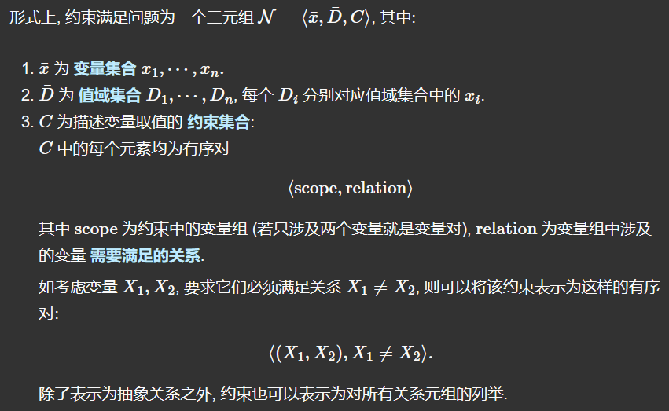

> 状态空间：由 **状态** 组成的集合. **状态**为对部分或全体变量的一个 **赋值**.
>
> - 相容性：某个赋值 **不违反任何约束条件**
> - 完整赋值：某个赋值中,**所有的变量均被赋值**
>
> 约束满足问题的解：某个问题的任何 **相容且完整** 的赋值为该问题的解
>
> 约束
>
> - 一元约束：只限制单个变量取值的约束
> - 二元约束：与两个变量相关的约束
> - 全局约束：**变量个数任意** 的约束
>
> 最简单的 `CSP` 问题涉及的变量是 **离散且值域有限** 的, 若值域无限, 则我们只能使用 **约束语言** 而非像有限值域情形下那样枚举受约束变量的所有可能取值. 这里暂不考虑值域无限的情形.


## 2. 约束传播

 **约束传播** ：逻辑推理. 由于在约束满足问题中, 对于一些变量的取值存在关系上的约束, 我们可以在利用这些约束来排除某些变量的非法取值, **缩小它的取值范围**, 并进一步根据变量间的关系**推断其他变量的取值范围**, 从而无需开始搜索即可==有效地对搜索树剪枝==

**局部相容性**: 若我们将变量视为某个图 (`Graph`) 中的节点 (`Vertices`), 变量间的约束视为图的边 (`Edges`), 则若要实现某些节点之间的局部相容性, 就必然导致其余不相容的节点被删除.


### 2.1节点相容性

> 称 **某个变量** 是 **节点相容的**, 若其值域中的所有取值都满足它的 **一元约束**.

显然, 通过执行节点相容, 我们总能消除给定 `CSP` 问题中的任何一元约束, **进而将任何 n 元约束转换为二元约束**. 在随后的内容中, 除非特殊定义, 否则我们默认考虑的求解对象均为二元约束.


### 2.2弧相容

> 称 **某个变量** 是 **弧相容的**, 若其值域中的所有值都满足它的所有 **二元约束**.
>
> 若每个变量对于其他变量都是弧相容的, 则称该网络为 **弧相容的**.

弧相容算法:

 (`AC-3`, AIAA版)

> 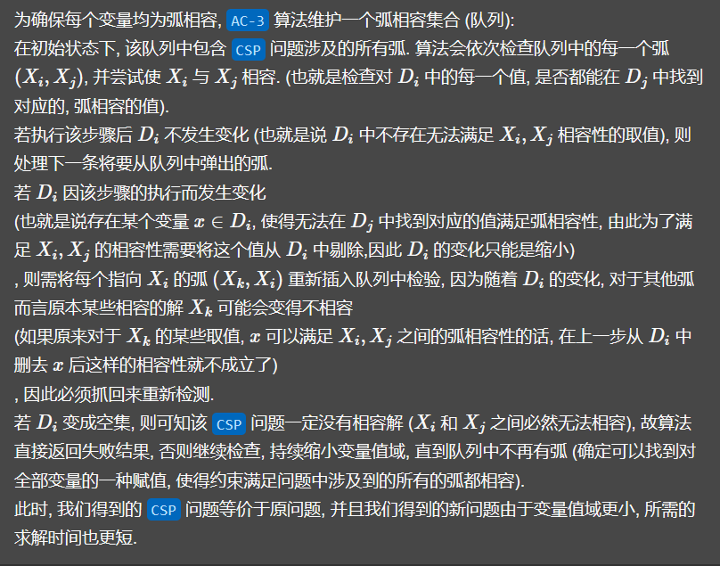
>
> 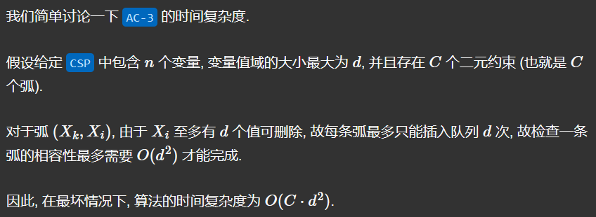

伪代码如下:

```C++
// returns false if an inconsistency is found
// and true otherwise
function boolean AC3(CSP csp) {
    // inputs: `csp`, a binary CSP with components(X, D, C).
    // local variables: `queue`, a queue of arcs, initially all the arcs in `csp`

    while (queue not empty) {
        arc (X_i, X_j) = queue.pop();
        if (REVISE(csp, X_i, X_j)) {
            if (D_i.size() == 0) {
                return false;
            }
            for (node X_k: X_i.Neighbors(X_j)) {
                queue.push(new arc(X_k, X_i));
            }
        }
    }
    return true;
}

// return true iff revised the domain of X_i
function boolean REVISE(csp, X_i, X_j) {
    boolean revised = false;
    for (node x : D_i) {
        if (no_value_in_D_j_allows_(x,y)_to_satisfy_the_constraint_between_X_i_and_X_j) {
            D_i.remove(x);
            revised = true;
        }
    }
    return revised;
}
```


 (`AC-3`, Slides版)

> 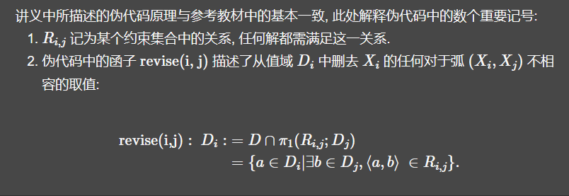

伪代码如下:

```
// returns false if an inconsistency is found
// and true otherwise
function AC3(CSP (X, D, C)) {
    // inputs: `(X, D, C)`, a binary CSP with components.
    // local variables: `Q`, a queue of arcs, initially empty, contains all the arcs in `(X, D, C)` after initialization.

    queue Q = null ;
    for (all i, j, satisfy R_{i,j} in constraint C) {
        Q.push(arc (X_i, X_j));
        Q.push(arc (X_j, X_i));
    }

    // while queue is not empty
    while (Q != null) {
        arc (X_i, X_j) = queue.pop();   // pop off some (X_i,X_j) off Q
        revise(X_i, X_j);
        if (the revise procedure causes a change in D_i) {
            //add to Q all (X_k, X_i) with R_{i,k} in C; i != k, j != k
        }
    }
}

// note the slides version doesn't cut off when it found the CSP is unsatisfiable

// and its revise() method only do the cuts in D_i but does not return any boolean value

// i.e. the pseudo code in the slides are not well implemente
```


### 2.3 有向弧相容性或直接弧相容

> 称约束满足问题 对于变量顺序 x=x1,⋯,xn为 **有向弧相容的** 或 **直接弧相容**, 


### 2.4 路径相容和 k−相容

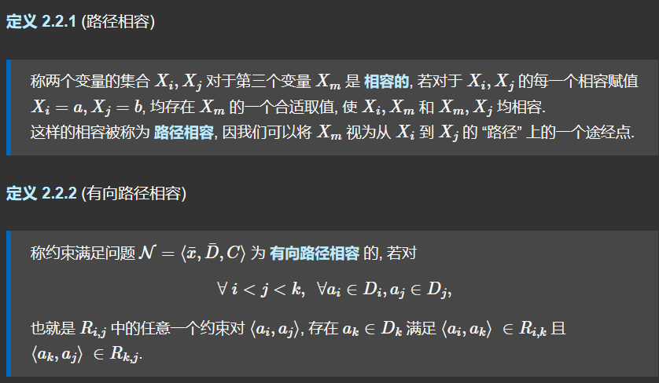

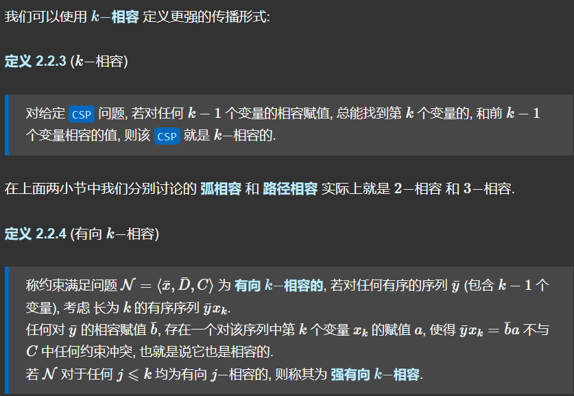


### 2.5 利用强有向 k−相容求解约束满足问题

  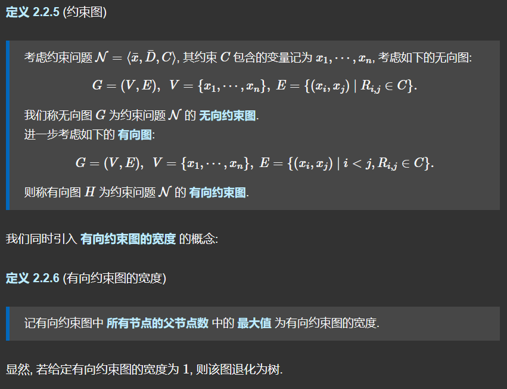

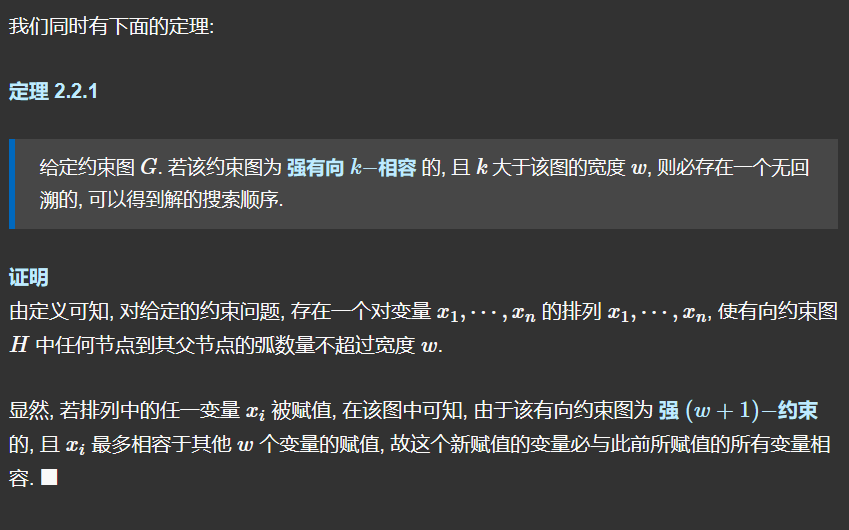

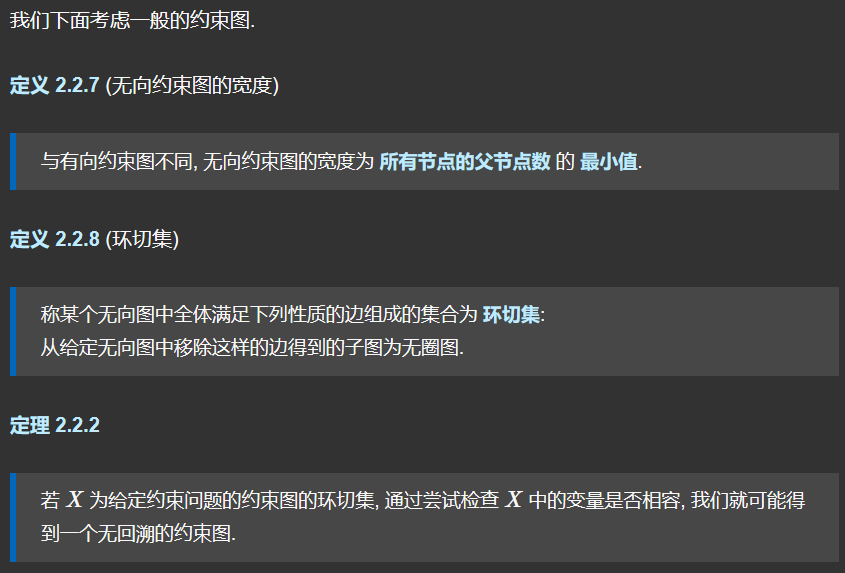

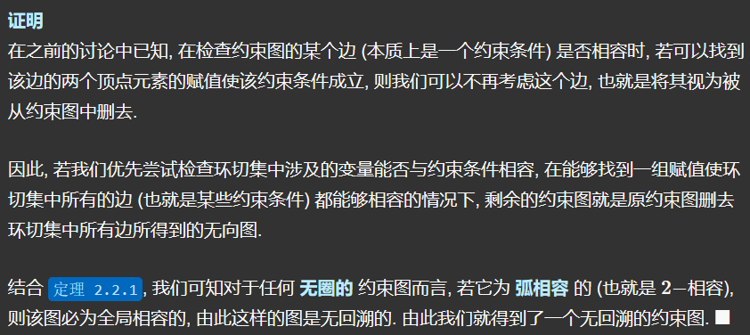


### 2.6 利用树分解求解约束满足问题

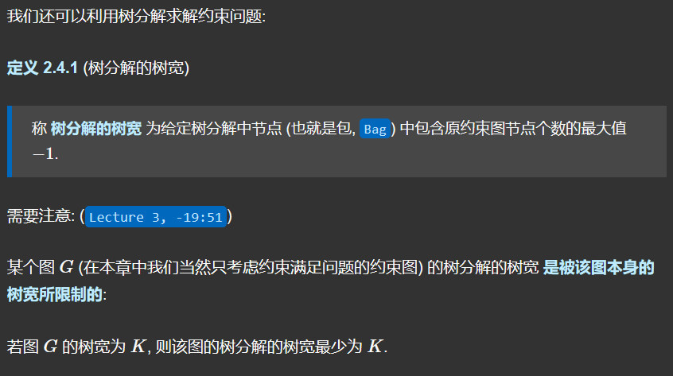


## 3. 约束满足问题的回溯算法

上面解释了求解约束满足问题时利用约束使用推理缩小可行解范围的原理和算法, 而在实际情况下很多 `CSP` 问题无法通过推理求解.

我们讨论在执行推理后的 **部分赋值** 的==回溯搜索==算法.

最简单的思路是使用标准的深度优先搜索 (`DFS` )寻找可行解. 考虑给定的 `CSP` 中有 n个值域大小为 d的变量, 则依次考虑每一层上所有变量的所有赋值, 类推 n层的话将会生成具 n⋅d^n^个叶节点的搜索树, 叶子的数量甚至超过了实际可选的不同完整赋值数 d^n^, 显然这一方法是不切实际的.

上述的问题建模忽略了 `CSP` 在给变量赋值时无需考虑赋值顺序的特征, 因此我们在每一层处只需考虑搜索树 **选定** 节点的 **单个** 变量. 在这个限制下, 叶节点的个数就回到了d^n^, 属于我们可接受的正常范围.

下面讨论 `SELECT-UNASSIGNED-VARIABLE()` 中选择新的, 未被赋值的变量的策略.

最简单的策略是按照列表顺序依次选择未赋值变量, 但显然优先选择 **剩余可能赋值更少** 的变量对搜索树的剪枝效果更好,最小化搜索树中的节点数. 这样的选择方法称为 **最少剩余值 (`MRV`)** 启发式

在变量被选定后, 我们还需要决定检验它的取值的顺序. 一种有效的选择方式称为 **最少约束值启发式**, 这一方法优先选择能够给 “邻居变量留下更多选择” 的值, 也就是说它总是选择给剩余变量赋值留下最大的空间, **最快地找到第一个解**.


## 4. 在搜索过程中执行推理

在上述几节中, 我们介绍了以 `AC-3` 算法为代表的, 在 **搜索前** 缩小变量的值域空间从而对搜索树剪枝的方法. 我们还可以 **在搜索过程中进行推理** 以进一步优化算法的性能: 每次在决定给某个变量赋予某个值时, 我们都可以推理它的临近变量的值域空间.

**前向检验** 是最简单的推理形式: 只要变量 X 被赋值, **前向检验** 就会对这个变量进行弧相容检查: 只要某个未赋值的变量 Y是通过某个约束和 X相关联的, 我们就要从 Y的值域中 **删去和 X不相容的可能取值**.


## 5. 结构化表示约束问题

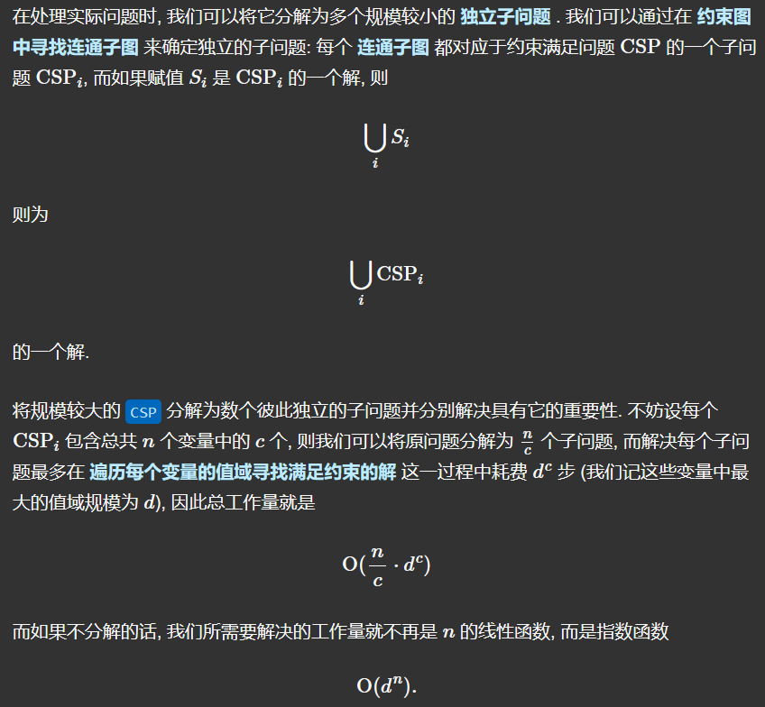

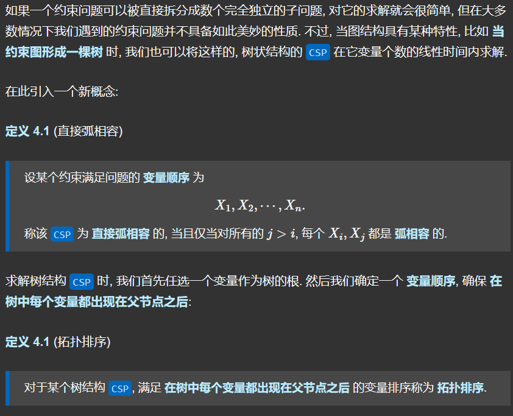

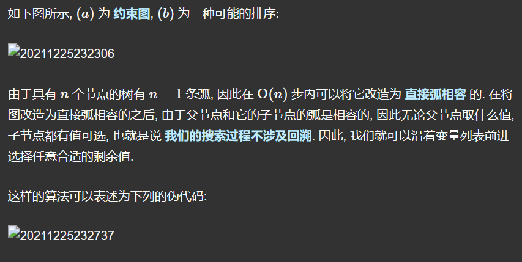

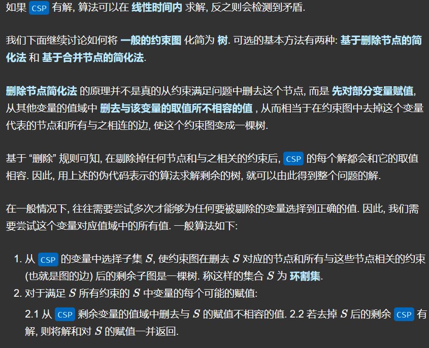

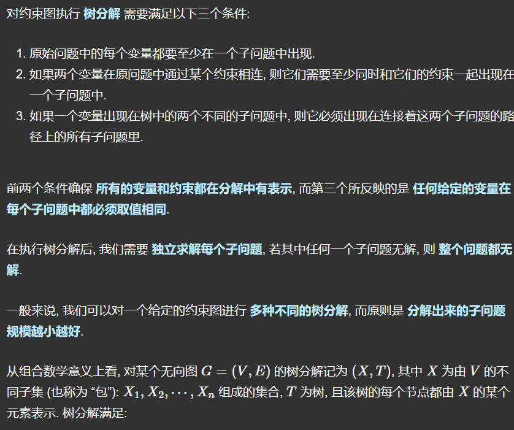

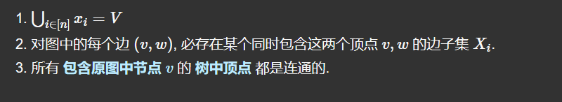


## 6.C++实现

> 求出八皇后问题共有多少种算法

```C++
#include<iostream>
using namespace std;
int a[9];
int b[9]={0};
int c[16]={0};
int d[16]={0};
int sum=0;

void searchh(int i)
{
    for(int j=1;j<=8;j++)
    {
        if((!b[j])&&(!c[i+j])&&(!d[i-j+7]))//每个皇后都有八个位置(列)可以试放
        {
            /********** Begin **********/
            if(i==8)
            {
                sum++;
                return;
            }
            b[j]=1;
            c[i+j]=1;
            d[i-j+7]=1;
            searchh(i+1);
            b[j]=0;
            c[i+j]=0;
            d[i-j+7]=0;
            /********** End **********/
        }
    }
}


```

