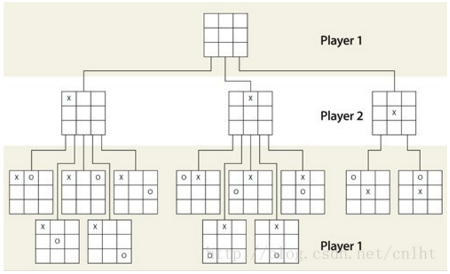
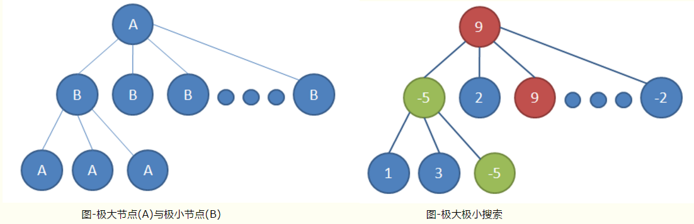
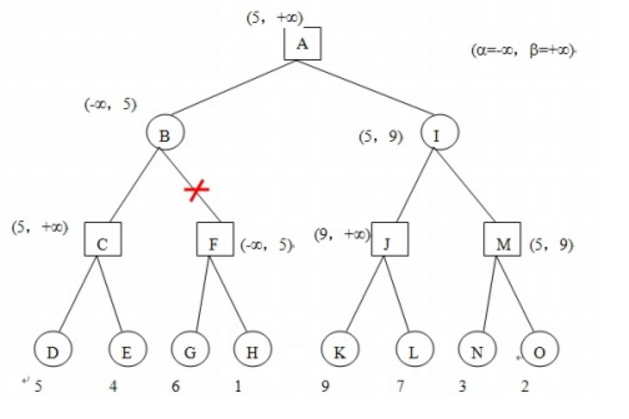

# 博弈树极大极小值alpha-beta剪枝搜索

> 搜索所有的下一步可能性，择优选择


## 博弈树搜索

> 深度优先搜索

相互采取最优策略斗争，比如说：

下五子棋，你下一步，我下一步，这就是相互博弈。假设棋盘的大小是10*10,那就是100个点可以下， 那么第一步可选择的可能就是100， 假设是下在了A点， 那么第二步就有除了A点的剩下的99个点的可能。  假设下在了B点， 那么第二步就有除了B点的剩下的99个点的可能，假设下在了C点...

看到没有， 我上面的假设可以复制100次， 同时基于其中的一个点，第二步又可以复制99次， 以此类推，就构成了一个树状的结构：




好了， 问题来了， 这么多可能性， 走哪一步才是最优的呢？ 这就是下一步，极大极小值搜索。 


## 极大极小值搜索

对于一个棋局， 判断它对我来说是占优势还是劣势， 能不能用个比较确定的数值来评估呢？

对于五子棋就是统计目前的棋型，并累加分数。 比如如果有4个子连起来了， 那就给个很高的评分，因为下一步就可以赢了， 如果是3个子连起来了，给个相对较低的评分，因为不一定就能赢，对方会堵你呢， 但是比只有2个子连在一起的得分要高吧， 如是就有了下面的棋型评分表：

```python
# 棋型的评估分数
# 常见的五子棋形状：1代表有子落在此处，0代表是空位；前面是对应的分值。
shape_score = [(50, (0, 1, 1, 0, 0)),
               (50, (0, 0, 1, 1, 0)),
               (200, (1, 1, 0, 1, 0)),
               (500, (0, 0, 1, 1, 1)),
               (500, (1, 1, 1, 0, 0)),
               (5000, (0, 1, 1, 1, 0)),
               (5000, (0, 1, 0, 1, 1, 0)),
               (5000, (0, 1, 1, 0, 1, 0)),
               (5000, (1, 1, 1, 0, 1)),
               (5000, (1, 1, 0, 1, 1)),
               (5000, (1, 0, 1, 1, 1)),
               (5000, (1, 1, 1, 1, 0)),
               (5000, (0, 1, 1, 1, 1)),
               (50000, (0, 1, 1, 1, 1, 0)),
               (99999999, (1, 1, 1, 1, 1))]
```

那么对应评估局面上的分数， 就是统计所有匹配的棋型得分并累加。这个分数的统计就叫做评估函数，而这个评估函数的好坏是非常重要的  

```python
# 评估函数
def evaluation(is_ai):
    total_score = 0

    if is_ai:
        my_list = list1
        enemy_list = list2
    else:
        my_list = list2
        enemy_list = list1

    # 算自己的得分
    score_all_arr = []  # 得分形状的位置 用于计算如果有相交 得分翻倍
    my_score = 0
    for pt in my_list:
        m = pt[0]
        n = pt[1]
        my_score += cal_score(m, n, 0, 1, enemy_list, my_list, score_all_arr)
        my_score += cal_score(m, n, 1, 0, enemy_list, my_list, score_all_arr)
        my_score += cal_score(m, n, 1, 1, enemy_list, my_list, score_all_arr)
        my_score += cal_score(m, n, -1, 1, enemy_list, my_list, score_all_arr)

    #  算敌人的得分， 并减去
    score_all_arr_enemy = []
    enemy_score = 0
    for pt in enemy_list:
        m = pt[0]
        n = pt[1]
        enemy_score += cal_score(m, n, 0, 1, my_list, enemy_list, score_all_arr_enemy)
        enemy_score += cal_score(m, n, 1, 0, my_list, enemy_list, score_all_arr_enemy)
        enemy_score += cal_score(m, n, 1, 1, my_list, enemy_list, score_all_arr_enemy)
        enemy_score += cal_score(m, n, -1, 1, my_list, enemy_list, score_all_arr_enemy)

    total_score = my_score - enemy_score*ratio*0.1

    return total_score
```

对于AI要走在那里最好，那就是计算它在走在某一个点后， 计算局面的得分，然后取得分最大的那个点，不就是最应该下的点吗？ so easy！  这就是**极大值搜索**

对手不傻，肯定会在我得分最小的那个点上下， 那就是对手的最优策略了（默认对手很聪明）， 这就是**极小值搜索**。



但不要忘了， 你这是只考虑了一步啊， 搜索的深度只有1， 没听说老谋深算的家伙都是考虑3步的吗， 也就是要考虑下了这一步后，对手下一步会怎么下。AI要考虑3步的话， 那就是搜索深度为3，那就是搜索落在那个点，3步后得分最大。

关于极大极小值的伪代码：

```python
int MinMax(int depth) { // 函数的评估都是以白方的角度来评估的
　if (SideToMove() == WHITE) {　// 白方是“最大”者 
　　return Max(depth); 
　} else {　　　　　　　　　　　// 黑方是“最小”者 
　　return Min(depth); 
　} 
}

int Max(int depth) { 
　int best = -INFINITY; 
　if (depth <= 0) { 
　　return Evaluate(); 
　} 
　GenerateLegalMoves(); 
　while (MovesLeft()) { 
　　MakeNextMove(); 
　　val = Min(depth - 1); 
　　UnmakeMove(); 
　　if (val > best) { 
　　　best = val; 
　　} 
　} 
　return best; 
} 　

int Min(int depth) { 
　int best = INFINITY;　// 注意这里不同于“最大”算法 
　if (depth <= 0) { 
　　return Evaluate(); 
　} 
　GenerateLegalMoves(); 
　while (MovesLeft()) { 
　　MakeNextMove(); 
　　val = Max(depth - 1); 
　　UnmakeMove(); 
　　if (val < best) { 　// 注意这里不同于“最大”算法 
　　　best = val; 
　　} 
　} 
　return best; 
} 
```

到这里， 感觉不就完了吗？可以和老家伙一决高下了？  这就错了， 忽略了一个很重要的问题， 就是搜索的计算量， 你以为计算机是机器，cpu是 intel i7就瞬间完成计算啊， 这个博弈树，之所以叫树，那么他的枝点的数量，是以指数增长的，搜索深度3和搜索深度5那计算量差的可不是几倍的概念，而是差指数倍的概念。 虽然五子棋棋盘没围棋大， 但是按照这种全部可能性都搜索的方法去搜索，是要死电脑的。 

于是，聪明的人对其进行了==优化==， 这就是alpha-beta剪枝搜索。 


## alpha-beta剪枝搜索

假设博弈树的搜索情况如下图：方形选手代表己方，希望得到最大得分，圆形选手代表对方，希望方形选手得分最少。简单说就是己方下棋使得棋局得分最高，对方下棋使得棋局得分最低，其中得分评估函数对结果具有指导性作用。



如上图所示，对于位于A点的棋局（此时己方选定一个位置下棋），对方下棋，下一步可以下成棋局B或I，对方一定选择一个使你得分少的情况。但作为一个优秀的棋手，我们要看的更远，探索对方下棋–>我再下棋—>对方下棋后的棋局得分，再采用极大极小值搜索的方式，算出己方选定下棋于此的得分至少值，对比其他下棋位置的至少得分，选择最佳位置下棋。

> - α为已知的极大值， β为已知的极小值， 因为还没搜索不知道是多少，保险起见，初始化为-∞  和+∞

父节点经过子左兄弟节点，得到当前的$\alpha$和$\beta$,这样的信息会传给右子兄弟节点，从而阻断一些无用的探索

> 什么是无用的探索？
>
> 例如上图B值在[-inf,5]区间内(左子节点得到)，那么==这样的信息也会延申到节点F==，F探索G得知F值应该在[6，inf]区间内，但是没必要继续探索右子节点了，为什么？
>
> 因为我们探索F值的目的是知道B值，但此时我们可以==推断出B的值==，而不需要完整的F的信息：
>
> F值一定在6以上（继续无用的探索，可得到F的准确值），但是我们求B值，要求最小值，那么我们B极小值一定是小于当前$\beta$的（也就是5），也就是F的值并不能对B值的判断造成影响，即直接RETURN ==导致剪枝的节点值==

总结：左兄弟节点给父节点带来的信息，会帮助父节点停止探索无用的右子节点

- 左边带来的$\alpha$帮助极大值父节点减去存在不大于$\alpha$的极小值子节点
- 左边带来的$\beta$帮助极小值父节点减去存在不小于$\beta$的极大值子节点


## 负值极大法

上面的伪代码有求极大值， 极小值， 还要两个函数；站在自己的一方， 其实都求各自的最大值， 对手的最大值前面加个负号，不就是对我来说的最小值吗?  这样的好处就是把求最大最小值写在一个函数里了

伪代码：

```python
int negamax(GameState S, int depth, int alpha, int beta) {
    // 游戏是否结束 || 探索的递归深度是否到边界
    if ( gameover(S) || depth == 0 ) {
        return evaluation(S);
    }
    // 遍历每一个候选步
    foreach ( move in candidate list ) {
        S' = makemove(S);
        value = -negamax(S', depth - 1, -beta, -alpha);
        unmakemove(S') 
        if ( value > alpha ) {
            // alpha + beta剪枝点
            if ( value >= beta ) {
                return beta;
            }
            alpha = value;
        }
    }
    return alpha;
}
```

原代码：

```python
# 负值极大算法搜索 alpha + beta剪枝
def negamax(is_ai, depth, alpha, beta):
    # 游戏是否结束 | | 探索的递归深度是否到边界
    if game_win(list1) or game_win(list2) or depth == 0:
        return evaluation(is_ai)

    blank_list = list(set(list_all).difference(set(list3)))
    order(blank_list)   # 搜索顺序排序  提高剪枝效率
    # 遍历每一个候选步
    for next_step in blank_list:

        global search_count
        search_count += 1

        # 如果要评估的位置没有相邻的子， 则不去评估  减少计算
        if not has_neightnor(next_step):
            continue

        if is_ai:
            list1.append(next_step)
        else:
            list2.append(next_step)
        list3.append(next_step)

        value = -negamax(not is_ai, depth - 1, -beta, -alpha)
        if is_ai:
            list1.remove(next_step)
        else:
            list2.remove(next_step)
        list3.remove(next_step)

        if value > alpha:

            print(str(value) + "alpha:" + str(alpha) + "beta:" + str(beta))
            print(list3)
            if depth == DEPTH:
                next_point[0] = next_step[0]
                next_point[1] = next_step[1]
            # alpha + beta剪枝点
            if value >= beta:
                global cut_count
                cut_count += 1
                return beta
            alpha = value

    return alpha
```


## 其他优化

-  搜索的开始点， 从上一步的点的周围搜索起，能尽快的找到相对较大的极大值， 和相对较小的极小值，从而更快的剪枝，因为邻近的点是最有可能的
- 为了减少计算量， 我还把四面八方都没有相邻的子的位置给去掉了， 因为这样的位置不大可能是有价值的位置， 当然这个优化不严谨， 但为了减少计算量


------

[源码](./gobang_AI.py)不重要， 重要的是这样的思想， 可以用来写**任何博弈类的AI，当然评估函数要写好**

## C++实现

```python
# -*- coding:utf-8 -*-

import copy     # 注意对象的深拷贝和浅拷贝的使用！！！

class GameNode:
    '''博弈树结点数据结构
    成员变量：
    name - string 结点名字
    val - int  结点值
    children - list[GameNode] 子结点列表
    '''
    def __init__(self, name='', val=0):
        self.name = name        # char
        self.val = val          # int
        self.children = []      # list of nodes

class GameTree:
    '''博弈树结点数据结构
    成员变量：
    root - GameNode 博弈树根结点
    成员函数：
    buildTree - 创建博弈树
    '''
    def __init__(self):
        self.root = None                # GameNode 博弈树根结点

    def buildTree(self, data_list, root):
        '''递归法创建博弈树
        参数：
        data_list - list[] like this ['A', ['B', ('E', 3), ('F', 12)], ['C', ('H', 2)], ['D', ('K', 14)]]
        root - GameNode
        '''
        #请在这里补充代码，完成本关任务
        #********** Begin **********#
        for i in range(1,len(data_list)):
            if type(data_list[i])==list:
                root.children.append(GameNode(data_list[i][0]))
                self.buildTree(data_list[i],root.children[i-1])
            else:
                root.children.append(GameNode(data_list[i][0],data_list[i][1]))
        #********** End **********#


class AlphaBeta:
    '''博弈树结点数据结构
    成员变量：
    game_tree - GameTree 博弈树
    成员函数：
    minmax_with_alphabeta - 带AlphaBeta剪枝的极大极小值算法，计算最优行动
    max_value - 计算最大值
    min_value - 计算最小值
    get_value - 返回结点的值
    isTerminal - 判断某结点是否为最终结点
    '''
    def __init__(self, game_tree):
        self.game_tree = game_tree      # GameTree 博弈树

    def minmax_with_alphabeta(self, node):
        '''带AlphaBeta剪枝的极大极小值算法，计算最优行动
        参数：
        node - GameNode 博弈树结点
        返回值：
        clf - GameNode 最优行动的结点
        '''
        #请在这里补充代码，完成本关任务
        #********** Begin **********#
        clf=self.max_value(node,-10000,10000)
        for child in node.children:
            if child.val==clf:
                return child;

        #********** End **********#


    def max_value(self, node, alpha, beta):
        '''计算最大值
        参数：
        node - GameNode 博弈树结点
        alpha - int 剪枝区间下限值
        beta - int 剪枝区间上限值
        返回值：
        clf - int 子结点中的最大的评估值
        '''
        #请在这里补充代码，完成本关任务
        #********** Begin **********#
        
        if self.isTerminal(node):
            return self.get_value(node)
        clf=-10000
        for child in node.children:
            clf=max(clf,self.min_value(child,alpha,beta))
            if clf>=beta:
                return clf
            alpha=max(alpha,clf)
        node.val=clf
        return clf

        #********** End **********#


    def min_value(self, node, alpha, beta):
        '''计算最小值
        参数：
        node - GameNode 博弈树结点
        alpha - int 剪枝区间下限值
        beta - int 剪枝区间上限值
        返回值：
        clf - int 子结点中的最小的评估值
        '''
        #请在这里补充代码，完成本关任务
        #********** Begin **********#
        if self.isTerminal(node):
            return self.get_value(node)
        clf=10000
        for child in node.children:
            clf=min(clf,self.max_value(child,alpha,beta))
            if clf<=alpha:
                return clf
            beta=min(clf,beta)
        node.val=clf
        return clf

        #********** End **********#


    def get_value(self, node):
        '''返回结点的值
        参数：
        node - GameNode 博弈树结点
        返回值：
        clf - int 结点的值，即 node.val
        '''
        #请在这里补充代码，完成本关任务
        #********** Begin **********#
        return node.val

        #********** End **********#


    def isTerminal(self, node):
        '''判断某结点是否为最终结点（无子结点）
        参数：
        node - GameNode 博弈树结点
        返回值：
        clf - bool 是最终状态，返回True，否则返回False
        '''
        #请在这里补充代码，完成本关任务
        #********** Begin **********#

        if node.val==0:
            return False
        else:
            return True
        #********** End **********#

```

